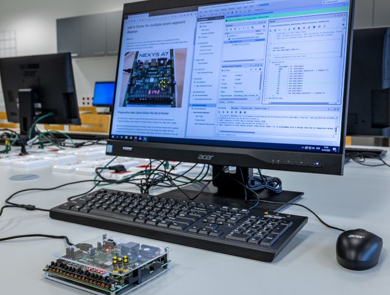

# Verilog Examples

This repository contains Verilog examples for the bachelor-level course [Digital Electronics](https://www.vut.cz/en/students/courses/detail/287953) at Brno University of Technology (Czechia).

## Labs

1. [Logic gates](lab1-gates)
2. [Binary comparator](lab2-comparator)
3. [Seven-segment display decoder](lab3-segment)
4. [Binary counter](lab4-counter)
5. [Multiple seven-segment displays](lab5-display)
6. [Button debounce](lab6-debounce)
7. [UART transmitter](lab7-uart)
8. Project
   * [Verilog projects 2026](lab8-project/README_2026.md)
9. [Verilog basic syntax reference](docs/README.md)

## Installation(s)

* Online [EDA Playground](https://edaplayground.com/) simulator (0 B)

* [Vivado Design Suite 2025.2](https://github.com/tomas-fryza/vhdl-examples/wiki/List-of-versions) (tens of GBs)

* **Icarus Verilog**, **GTKWave**, text editor such se VS Code, and command line.

   ```verilog
   // Part of testbench
   initial begin
       // Waveform dump for GTKWave
       $dumpfile("gates.vcd");
       $dumpvars(0, gates_tb);
   end
   ```

   Commands:

   ```bash
   # compile the design (`gates.v`)
   # compile the testbench (`gates_tb.v`)
   # produce a simulation executable (`sim`)
   $ iverilog -g2012 -o sim gates.v gates_tb.v

   # run the simulation
   # generate the waveform file (`gates.vcd`)
   $ vvp sim

   # open waveform in GTKWave
   $ gtkwave gates.vcd
   ```

   
