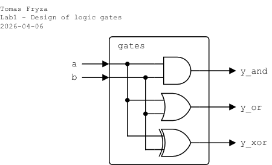
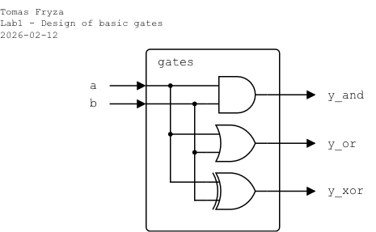

# Laboratory 1: Basic logic gates

### Objectives

After completing this laboratory, students will be able to:

- Describe the structure of a simple Verilog module
- Implement basic combinational logic using Verilog operators
- Use continuous assignments (`assign`) correctly
- Create a simple Verilog testbench
- Simulate a design and analyze waveforms

### Background

Digital systems are built from **logic gates**, which implement Boolean functions. In this laboratory, three fundamental gates are implemented:

   - **AND**: Output is `1` only when both inputs are `1`.
   - **OR**: Output is `1` when at least one input is `1`.
   - **XOR**: Output is `1` when inputs are different.

   

De Morgan's laws are two fundamental rules in Boolean algebra that are used to simplify Boolean expressions:

   * De Morgan's law for AND: The complement of the product of two operands is equal to the sum of the complements of the operands.
   * De Morgan's law for OR: The complement of the sum of two operands is equal to the product of the complements of the operands.

      

   <!-- https://latexeditor.lagrida.com/ font size 16
   \begin{align*}
      \overline{a\cdot b} =&~ \overline{a} + \overline{b}\\
      \overline{a+b} =&~ \overline{a}\cdot \overline{b}\\
   \end{align*}
   -->

**Hardware Description Languages** (HDLs) are used to model, design, and simulate digital hardware systems by describing their structure and behavior. VHDL and Verilog are the two most widely used HDLs, both allowing engineers to create designs for digital circuits such as processors, controllers, and FPGA implementations. **VHDL** is strongly typed and more verbose, making it popular in academic, aerospace, and safety-critical applications, while **Verilog** has a C-like syntax and is often considered easier to learn and more concise. Both languages support parallel hardware behavior and timing, which distinguishes them from traditional software programming languages. Designs written in VHDL or Verilog can be simulated for verification and synthesized into real hardware.

In Verilog, combinational logic can be described using **continuous assignments**, which represent hardware that operates in parallel. All such assignments exist and function simultaneously, meaning there is **no execution order** as in software—each assignment continuously reflects changes in its inputs:

   ```verilog
   assign y = a & b;  // AND gate
   ```

## Task 1

Design a circuit that implements the following logic functions:

   - one 2-input **AND** gate,
   - one 2-input **OR** gate,
   - one 2-input **XOR** gate.

The module shall have two single-bit inputs `a`, `b` and three single-bit outputs `y_and`, `y_or`, `y_xor`.

   - Use **combinational logic only**
   - Use **continuous assignments** (`assign`)
   - Do not use clocks or sequential logic
   - The design must be synthesizable
   - All input combinations must be verified by simulation

   

1. Create a file named **`gates.v`** and use the following template:

    ```verilog
    // =================================================
    // Basic logic gates
    // =================================================

    module gates (
        input  wire a,      // First input

        // TODO: Complete input/output ports

        output wire y_xor   // XOR output
    );

        // ---------------------------------------------
        // TODO: Implement logic gates using assign
        // ---------------------------------------------
        // assign y_and = ...
        // assign y_or  = ...
        // assign y_xor = ...

    endmodule
    ```

2. Create a truth table for all input combinations.

3. The primary approach to testing VHDL designs involves creating a **testbench**. A testbench is essentially a separate VHDL file that stimulates the design under test (DUT) with various input values and monitors its outputs to verify correct functionality. The testbench typically includes DUT component instantiation and stimulus generation.

   

   Create a file named **`gates_tb.v`** and use the following template to verify your design by simulation.

      - All four possible input combinations must be applied: `00`, `01`, `10`, `11`.
      - Each input combination should remain stable for a defined simulation time (e.g., `#10`).
      - The simulation must generate a waveform file (`gates.vcd`).
      - The simulation must terminate using `$finish`.

    ```verilog
    `timescale 1ns/1ps

    // =================================================
    // Testbench for basic logic gates
    // =================================================

    module gates_tb ();  // Testbench module has no ports

        // ---------------------------------------------
        // Testbench internal signals
        // reg  = driven by testbench
        // wire = driven by DUT outputs
        // ---------------------------------------------
        reg  a;
        reg  b;
        wire y_and;
        wire y_or;
        wire y_xor;

        // ---------------------------------------------
        // Instantiate Device Under Test (DUT)
        // ---------------------------------------------
        gates dut (
            .a     (a),
            .b     (b),
            .y_and (y_and),
            .y_or  (y_or),
            .y_xor (y_xor)
        );

        // ---------------------------------------------
        // Stimulus process
        // ---------------------------------------------
        initial begin
            // Waveform dump for GTKWave
            $dumpfile("gates.vcd");
            $dumpvars(0, gates_tb);

            // Test vectors
            // Set both `a`, `b` and wait 10 time units
            a = 0; b = 0; #10;

            // TODO: Apply all input combinations

            $finish;
        end

    endmodule
    ```

4. Verify that the behavior corresponds exactly to the truth table above.

## Task 2: De Morgan's laws

1. Propose a 3-input logic function, use De Morgan's laws, and implement the function using only NAND or NOR operators.

2. Create a new source file `demorgan.vhd` with the following I/O ports:

   * Port name: `a`, Direction: `in`
   * `b`, `in`
   * `c`, `in`
   * `f_org`, `out`
   * `f_nand`, `out`
   * `f_nor`, `out`

   Complete the `module`, add a new simulation source file `demorgan_tb.vhd`, and verify that `f_org`, `f_nand`, and `f_nor` are identical for all 8 input combinations.

## Optional tasks

1. Implement XOR using only AND, OR, NOT.

2. Modify the testbench to print results to the console using `$display`, such as:

  ```verilog
  $display("[%0t] %b %b | %b %b %b", $time, b, a, y_and, y_or, y_xor);
  ```

3. If you want to use online [EDA Playground](https://www.edaplayground.com) tool, you will need Google account, Facebook account, or register your account on EDA Playground.

4. In addition to the professional Vivado tool, which requires significant local disk storage, other simulation tools are available, including **Icarus Verilog**, **GTKWave**, any text editor such se VS Code, and command line.

    ```bash
    # compile the design (`gates.v`)
    # compile the testbench (`gates_tb.v`)
    # produce a simulation executable (`sim`)
    $ iverilog -g2012 -o sim gates.v gates_tb.v

    # run the simulation
    # generate the waveform file (`gates.vcd`)
    $ vvp sim

    # open waveform in GTKWave
    $ gtkwave gates.vcd
    ```

## Questions

<!--What is the difference between assign and always blocks?-->

1. Why does the testbench module have no ports?

2. What happens if one `assign` statement is missing?

3. Why are testbench input signals declared as `reg`?
