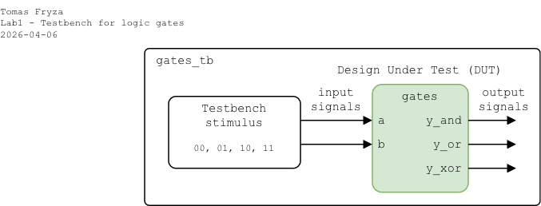

# Laboratory 1 – Basic Logic Gates
Digital Electronics – Verilog  
Simulation using Icarus Verilog + GTKWave

## 1. Objectives

After completing this laboratory, students will be able to:

- describe the structure of a simple Verilog module,
- implement basic combinational logic using Verilog operators,
- use continuous assignments (`assign`) correctly,
- create a simple Verilog testbench,
- simulate a design and analyze waveforms.

## 2. Background

Digital systems are built from **logic gates**, which implement Boolean functions. In this laboratory, three fundamental gates are implemented:

   - **AND**: Output is `1` only when both inputs are `1`.
   - **OR**: Output is `1` when at least one input is `1`.
   - **XOR**: Output is `1` when inputs are different.

In Verilog, combinational logic can be described using **continuous assignments**:

   ```verilog
   assign y = a & b;  // AND gate
   ```

Concurrent assignments exist simultaneously in hardware; there is **no execution order**.

## 3. Task

Design a Verilog module that implements the following logic functions:

- one 2-input **AND** gate,
- one 2-input **OR** gate,
- one 2-input **XOR** gate.

The module shall have two single-bit inputs `a`, `b` and three single-bit outputs `y_and`, `y_or`, `y_xor`.

- Use **combinational logic only**
- Use **continuous assignments** (`assign`)
- Do not use clocks or sequential logic
- The design must be synthesizable
- All input combinations must be verified by simulation

## 4. Provided Templates

Create a file named **`gates.v`** and use the following template:

```verilog
// =================================================
// Basic logic gates
// =================================================

module gates (
    input  wire a,      // First input

    // TODO: Complete input/output ports

    output wire y_xor   // XOR output
);

    // ---------------------------------------------
    // TODO: Implement logic gates using assign
    // ---------------------------------------------
    // assign y_and = ...
    // assign y_or  = ...
    // assign y_xor = ...

endmodule
```

The primary approach to testing VHDL designs involves creating a **testbench**. A testbench is essentially a separate VHDL file that stimulates the design under test (DUT) with various input values and monitors its outputs to verify correct functionality. The testbench typically includes DUT component instantiation and stimulus generation.

   

Create a file named **`gates_tb.v`** and use the following template to verify your design by simulation.

```verilog
`timescale 1ns/1ps

// =================================================
// Testbench for basic logic gates
// =================================================

module gates_tb ();  // Testbench module has no ports

    // ---------------------------------------------
    // Testbench internal signals
    // reg  = driven by testbench
    // wire = driven by DUT outputs
    // ---------------------------------------------
    reg  a;
    reg  b;
    wire y_and;
    wire y_or;
    wire y_xor;

    // ---------------------------------------------
    // Instantiate Device Under Test (DUT)
    // ---------------------------------------------
    gates dut (
        .a     (a),
        .b     (b),
        .y_and (y_and),
        .y_or  (y_or),
        .y_xor (y_xor)
    );

    // ---------------------------------------------
    // Stimulus process
    // ---------------------------------------------
    initial begin
        // Waveform dump for GTKWave
        $dumpfile("gates.vcd");
        $dumpvars(0, gates_tb);

        // Test vectors
        // Set both `a`, `b` and wait 10 time units
        a = 0; b = 0; #10;

        // TODO: Apply all input combinations

        $finish;
    end

endmodule
```

## 5. Verification / Testing

After completing the design, verify correct functionality by simulation.

- All four possible input combinations must be applied: `00`, `01`, `10`, `11`.
- Each input combination should remain stable for a defined simulation time (e.g., `#10`).
- The simulation must generate a waveform file (`gates.vcd`).
- The simulation must terminate using `$finish`.

### Expected Truth Table

| a | b | AND | OR | XOR |
|---|---|-----|----|-----|
| 0 | 0 |  0  | 0  |  0  |
| 0 | 1 |  0  | 1  |  1  |
| 1 | 0 |  0  | 1  |  1  |
| 1 | 1 |  1  | 1  |  0  |

### Waveform Verification

Open the generated `.vcd` file in GTKWave and verify that:

- Inputs `a` and `b` change according to the stimulus.
- Outputs update immediately after input changes.
- There is no clock signal.
- No unknown (`X`) or high-impedance (`Z`) values appear.

The behavior must correspond exactly to the truth table above.

### Compile and Run Simulation from Command Line

The simulation can be performed using **Icarus Verilog** from the terminal.

1. Compile the design and testbench:

    ```bash
    $ iverilog -o sim gates.v gates_tb.v
    ```

    - compiles the design (`gates.v`)
    - compiles the testbench (`gates_tb.v`)
    - produces a simulation executable (`sim`)

2. Run the simulation:

    ```bash
    $ vvp sim
    ```

    - runs the simulation
    - generates the waveform file (`gates.vcd`)

3. Open waveform in GTKWave:

    ```bash
    $ gtkwave gates.vcd
    ```

## 6. Optional Tasks

1. Modify the testbench to print results to the console using `$display`, such as:

  ```verilog
  $display("[%0t] %b %b | %b %b %b", $time, b, a, y_and, y_or, y_xor);
  ```

2. Use deMorgan laws and replace individual gates with Boolean expressions.

3. Implement additional gates (NAND, NOR).

## 7. Questions

<!--What is the difference between assign and always blocks?-->

1. Why does the testbench module have no ports?

2. What happens if one `assign` statement is missing?

3. Why are testbench input signals declared as `reg`?
