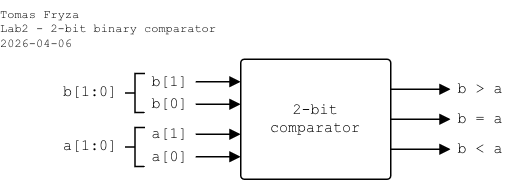
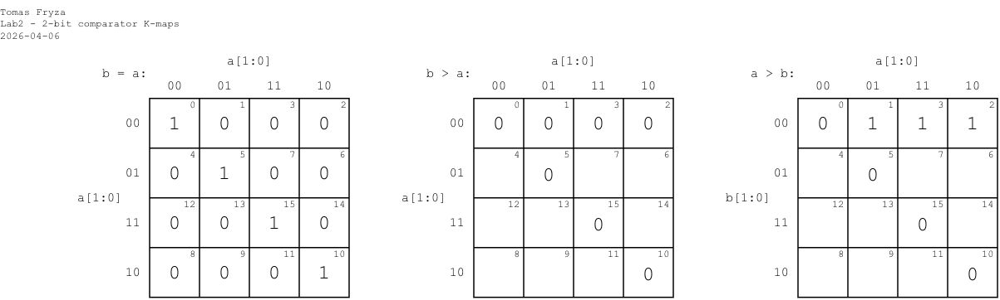

# Laboratory 2: Binary comparator  

* [Task 1: Logic function minimization](#task1)
* [Task 2: 2-bit binary comparator](#task2)
* [Task 3: Checking simulation values](#task3)
* [Optional tasks](#tasks)
* [Questions](#questions)

### Objectives

After completing this lab, students should be able to:

* Use truth table, K-map, SoP/PoS forms of logic functions
* Work with multi-bit signals
* Use relational operators (`>`, `<`, `==`)
* Use simple checking for testing

### Background

*[Karnaugh Maps](https://learnabout-electronics.org/Digital/dig24.php) (or K-maps)* offer a graphical method of reducing a digital circuit to its minimum number of gates. The map is a simple table containing `1`s and `0`s that can express a truth table or complex Boolean expression describing the operation of a digital circuit.

*Digital* or *Binary comparator* compares the digital signals A, B presented at input terminal and produce outputs depending upon the condition of those inputs.

   

<a name="task1"></a>

## Task 1: Logic function minimization

1. Complete the truth table for 2-bit *Identity comparator* (B equals A), and two *Magnitude comparators* (B is greater than A, A is greater than B). Note that, such a digital device has four inputs and three outputs/functions but only **one output** should be HIGH at a time:

   - `b_gt`: Output is `1` when `b > a`
   - `b_a_eq`: Output is `1` when `b == a`
   - `a_gt`: Output is `1` when `b < a`

   | **Dec. equivalent** | **B[1:0]** | **A[1:0]** | **B is greater than A** | **B equals A** | **A is greater than B** |
   | :-: | :-: | :-: | :-: | :-: | :-: |
   |  0 | 0 0 | 0 0 | 0 | 1 | 0 |
   |  1 | 0 0 | 0 1 | 0 | 0 | 1 |
   |  2 | 0 0 | 1 0 | 0 | 0 | 1 |
   |  3 | 0 0 | 1 1 | 0 | 0 | 1 |
   |  4 | 0 1 | 0 0 |  | 0 |  |
   |  5 | 0 1 | 0 1 |  | 1 |  |
   |  6 | 0 1 | 1 0 |  | 0 |  |
   |  7 | 0 1 | 1 1 |  | 0 |  |
   |  8 | 1 0 | 0 0 |  | 0 |  |
   |  9 | 1 0 | 0 1 |  | 0 |  |
   | 10 | 1 0 | 1 0 |  | 1 |  |
   | 11 | 1 0 | 1 1 |  | 0 |  |
   | 12 | 1 1 | 0 0 |  | 0 |  |
   | 13 | 1 1 | 0 1 |  | 0 |  |
   | 14 | 1 1 | 1 0 |  | 0 |  |
   | 15 | 1 1 | 1 1 |  | 1 |  |

2. According to truth table, create K-maps for all functions.

   

3. Use K-maps to create simplified SoP and PoS forms of "B greater than A" function.

<a name="task2"></a>

## Task 2: 2-bit binary comparator

Design a circuit that implements a **2-bit binary comparator**. The comparator shall compare two 2-bit unsigned inputs `a` and `b` and generate three mutually exclusive outputs `b_gt`, `b_a_eq`, `a_gt`.

   - Use 2-bit input busses `[1:0] a`, `[1:0] b`
   - Use **combinational logic only**
   - Use **continuous assignments** (`assign`)
   - Do not use clocks or sequential logic
   - The design must be synthesizable
   - Only **one output may be HIGH at a time** (one-hot behavior)
   - All 16 input combinations must be verified by simulation

1. Run Vivado and create a new project:

   1. Project name: `comparator`
   2. Project location: your working folder, such as `Documents`
   3. Project type: **RTL Project**
   4. Create a new VHDL source file: `compare_2bit`
   5. Do not add any constraints now
   6. Choose a default board: `Nexys A7-50T`
   7. Click **Finish** to create the project
   8. Define I/O ports of new module:

      * Port name: `a`, Direction: `in`, Bus: `check`, MSB: `1`, LSB: `0`
      * `b`, `in`, Bus: `check`, MSB: `1`, LSB: `0`
      * `b_gt`, `out`
      * `b_a_eq`, `out`
      * `a_gt`, `out`

2. Open a file **`compare_2bit.v`** and complete the following template:

    ```verilog
    // =================================================
    // 2-bit binary comparator
    // =================================================

    module compare_2bit (
        input  wire [1:0] b,

        // TODO: Complete input/output ports

        output wire       a_gt
    );

        // ---------------------------------------------
        // Method 1: Behavioral (recommended for design)
        // ---------------------------------------------
        assign b_gt   = (b > a);
        assign b_a_eq = (b == a);
        assign a_gt   = (b < a);

        // ---------------------------------------------
        // Method 2: Gate-level implementation (for learning only)
        // This logic is derived from the truth table for
        // a 2-bit magnitude comparator.
        // ---------------------------------------------

    endmodule
    ```

3. Add a new simulation file named **`compare_2bit_tb.v`**, complete the following template, and verify your design by simulation:

    ```verilog
    `timescale 1ns/1ps

    module compare_2bit_tb;

        reg [1:0] b;
        reg [1:0] a;
        wire      b_gt;
        wire      b_a_eq;
        wire      a_gt;

        compare_2bit dut (
            .b(b),
            .a(a),
            .b_gt(b_gt),
            .b_a_eq(b_a_eq),
            .a_gt(a_gt)
        );

        integer i, j;

        initial begin

            $dumpfile("compare_2bit.vcd");
            $dumpvars(0, compare_2bit_tb);

            $display("Time  b  a | b>a b=a b<a");
            $display("-------------------------");

            for (i = 0; i < 4; i = i + 1) begin
                for (j = 0; j < 4; j = j + 1) begin
                    b = i[1:0];
                    a = j[1:0];
                    #10;

                    $display("%4t  %0d  %0d |  %b   %b    %b",
                            $time, b, a, b_gt, b_a_eq, a_gt);
                end
            end

            $finish;
        end

    endmodule
    ```

    > **Note:** The simulation can be done without Vivado, using Icarus Verilog and GTKWave:
    > 
    > ```bash
    > $ iverilog -g2012 -o sim compare_2bit.v compare_2bit_tb.v
    > $ vvp sim
    > $ gtkwave compare_2bit.vcd
    > ```

4. In `module`, use method 2 and implement `b_gt` using minimized Boolean equation in SoP or PoS logic at gate-level. Simulate it. Compare waveform results with behavioral version.

   > **Note:** The behavioral implementation is synthesizable and preferred in real designs because it is clearer, scalable, and less error-prone than manual Boolean equations.

<a name="task3"></a>

## Task 3: Checking simulation values

Whereever possible, include code to automatically check whether the DUT's outputs match expected results. Do not rely only on manual waveform inspection.

Using monitors and checkers in testbenches in Verilog involves integrating tools and techniques to enhance the verification and validation process of digital designs. Both monitors and checkers play crucial roles in ensuring that the design behaves as expected during simulation.

**Monitors** are used to observe and report the behavior of signals and variables within a design under test (DUT). They continuously track changes in signal values and interactions within the design.

**Checkers** are used to enforce and verify that the design adheres to specified constraints, properties, or expected behaviors. They actively check for correctness and compliance with predefined rules.

TBD


<a name="tasks"></a>

## Optional tasks

1. Extend comparator to 4-bit (scalability).

2. Design a [*Prime number detector*](https://link.springer.com/chapter/10.1007/978-3-030-10552-5_1) that takes in values from 0 to 15.

   

<a name="questions"></a>

## Questions

1. What is the advantage of using K-maps instead of directly writing SoP expressions?

2. Why is using relational operators preferred over manual Boolean equations?

3. Why must only one comparator output be high at a time?

4. How many input combinations must be tested for a 2-bit comparator?

5. What happens if you forget `#10` in the loop?
