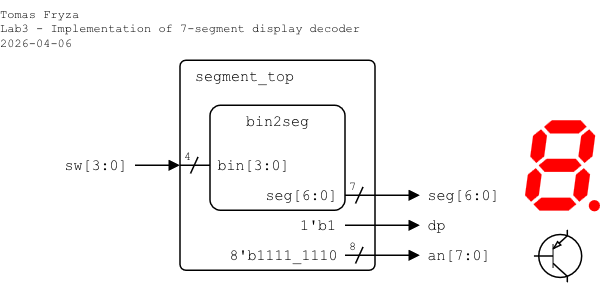
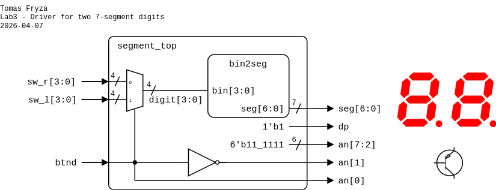

# Laboratory 3: Seven-segment display decoder

* [Task 1: Seven-segment display decoder](#task1)
* [Task 2: Structural modeling and instantiation](#task2)
* [Task 3: Top-level design and FPGA implementation](#task3)
* [Optional tasks](#tasks)
* [Questions](#questions)

### Objectives

After completing this laboratory, students will be able to:

* Use 7-segment display
* Use Verilog processes
* Understand the structural modeling and instantiation in Verilog
* Implement design to real hardware

### Background

The Binary to 7-Segment Decoder converts 4-bit binary data to 7-bit control signals which can be displayed on 7-segment display. A display consists of 7 LED segments to display the decimal digits `0` to `9` and letters `A` to `F`.

Note that, there are other types of segment displays, such as 9-, 14- or 16-segment.

    &nbsp; &nbsp; &nbsp; &nbsp;
    &nbsp; &nbsp; &nbsp; &nbsp;
    &nbsp; &nbsp; &nbsp; &nbsp;
   

The Nexys A7 board provides two four-digit common anode seven-segment LED displays (configured to behave like a single eight-digit display). See [schematic](https://github.com/tomas-fryza/verilog-examples/blob/master/docs/nexys-a7-sch.pdf) or [reference manual](https://reference.digilentinc.com/reference/programmable-logic/nexys-a7/reference-manual) of the Nexys A7 board and find out the connection of 7-segment displays and push-buttons. What is the difference between NPN and PNP type of BJT (Bipolar Junction Transistor).

   

<a name="task1"></a>

## Task 1: Seven-segment display decoder

1. Complete the decoder truth table for a **common anode** (active low) 7-segment display.

   

   | **Symbol** | **bin** | **a** | **b** | **c** | **d** | **e** | **f** | **g** |
   | :-: | :-: | :-: | :-: | :-: | :-: | :-: | :-: | :-: |
   | `0` | 0000 | 0 | 0 | 0 | 0 | 0 | 0 | 1 |
   | `1` | 0001 | 1 | 0 | 0 | 1 | 1 | 1 | 1 |
   | `2` | 0010 | 0 | 0 | 1 | 0 | 0 | 1 | 0 |
   | `3` |      |   |   |   |   |   |   |   |
   | `4` |      |   |   |   |   |   |   |   |
   | `5` |      |   |   |   |   |   |   |   |
   | `6` |      |   |   |   |   |   |   |   |
   | `7` | 0111 | 0 | 0 | 0 | 1 | 1 | 1 | 1 |
   | `8` | 1000 | 0 | 0 | 0 | 0 | 0 | 0 | 0 |
   | `9` | 1001 | 0 | 0 | 0 | 0 | 1 | 0 | 0 |
   | `A` |      |   |   |   |   |   |   |   |
   | `b` |      |   |   |   |   |   |   |   |
   | `C` |      |   |   |   |   |   |   |   |
   | `d` |      |   |   |   |   |   |   |   |
   | `E` | 1110 | 0 | 1 | 1 | 0 | 0 | 0 | 0 |
   | `F` | 1111 | 0 | 1 | 1 | 1 | 0 | 0 | 0 |

2. Run Vivado, create a new RTL project named `segment` with a Verilog source file `bin2seg`. Use the following I/O ports:

   | **Port name** | **Direction** | **Type** | **Description** |
   | :-: | :-: | :-- | :-- |
   | `bin` | input | `wire [3:0]` | 4-bit hexadecimal input |
   | `seg` | output | `reg wire [6:0]` | {a,b,c,d,e,f,g} active-low outputs |

   > **Note:** Because `seg` will be assigned inside an always block (see below), it must be declared as reg in Verilog. This does NOT mean it becomes a flip-flop or register in hardware.

3. Use a Verilog **combinational procedural block** `always @(*) begin ... end` to describe the inner module structure. The `always` block executes whenever a signal in its sensitivity list (ie. signal after the `@` symbol) changes. Here, `(*)` means all signals used inside the block and the simulator automatically creates a complete sensitivity list.

   ```verilog
   module bin2seg (
       input  wire [3:0] bin,  //! 4-bit input
       output reg  [6:0] seg   //! {a,b,c,d,e,f,g} active-low
   );

   always @(*) begin
       case (bin)
           4'h0: seg = 7'b000_0001;  // 0
           4'h1: seg = 7'b100_1111;  // 1
           4'h2: seg = 7'b001_0010;  // 2

           // TODO: Complete settings for 3, 4, 5, 6

           4'h7: seg = 7'b000_1111;  // 7
           4'h8: seg = 7'b000_0000;  // 8
           4'h9: seg = 7'b000_0100;  // 9

           // TODO: Complete settings for A, b, C, d

           4'hE: seg = 7'b011_0000;  // E
           4'hF: seg = 7'b011_1000;  // F

           default: seg = 7'b111_1111;  // Blank for safety
       endcase
   end
   ```

   > **Note:** The notation `4'h0: seg = 7'b000_0001;` means
   >
   >    * `4'h0` -- a 4-bit hexadecimal value 0
   >       * `4` = width (4 bits)
   >       * `'h` = hexadecimal base
   >       * `0` = value
   >    * `seg = 7'b000_0001;` -- assign a 7-bit binary value to `seg`
   >       * `7` = width (7 bits)
   >       * `'b` = binary base
   >       * `000_0001` = binary pattern (underscore is just for readability)

4. Create a Verilog simulation file named `bin2seg_tb`, complete the provided template using `$display` and `$monitor` tasks, and verify the functionality of your decoder.

   ```verilog
   `timescale 1ns/1ps

   module bin2seg_tb ();

       reg  [3:0] bin;  // DUT input: 4-bit value
       wire [6:0] seg;  // DUT output: {a,b,c,d,e,f,g}, active-low

       bin2seg dut (
           .bin (bin),
           .seg (seg)
       );

       integer i;  // Loop variable

       initial begin

           // TODO: Add $display and $monitor tasks

           for (i = 0; i < 16; i = i+1) begin
               bin = i[3:0];  // Use only lowest 4 bits of i
               #10;
           end

           $finish;
       end

   endmodule
   ```

5. Use **Flow > Open Elaborated design** and see the schematic after RTL analysis. Note that RTL (Register Transfer Level) represents digital circuit at the abstract level.

<a name="task2"></a>

## Task 2: Structural modeling and instantiation

**Structural design** is a modeling style in digital hardware description languages (such as VHDL or Verilog) where a system is described by connecting smaller building blocks together. Instead of describing what the logic does (behavioral style), structural design describes how the system is built from submodules.

**Component instantiation** is the act of creating an instance of a previously defined module/entity inside another design unit. When you instantiate a component: (a) you create a copy of that hardware block, (b) connect its input and output ports to signals, and (c) integrate it into a higher-level system.

The following example shows a simple structural design consisting of two 2-input XOR gates. The top-level entity connects two instances (`U1` and `U2`) of the `xor2` component.

   

   XOR module:

   ```verilog
   module xor2 (
       input  in1,
       input  in2,
       output out1
   );
       assign out1 = in1 ^ in2;
   endmodule
   ```

   Top-level structural design:

   ```verilog
   module top_level (
       input  a,
       input  b,
       input  c,
       output y
   );

       wire sig_tmp;  // Internal signal

       // First XOR instance
       xor2 U1 (
           .in1  (a),
           .in2  (b),
           .out1 (sig_tmp)
       );

       // Second XOR instance
       xor2 U2 (
           .in1  (sig_tmp),
           .in2  (c),
           .out1 (y)
       );

   endmodule
   ```

In this example, `U1` and `U2` are two independent instances of the same component, the signal `sig_tmp` connects the output of the first XOR gate to the input of the second, and the architecture describes a structural netlist rather than behavioral logic.

<a name="task3"></a>

## Task 3: Top-level design and FPGA implementation

In this task, you will integrate your `bin2seg` decoder into a **top-level entity** and implement the design on the **Nexys A7 FPGA board**. The 4-bit input value will be provided by slide switches, and the decoded output will drive one digit of the onboard 7-segment display.

1. Create a new Verilog design source named `segment_top`.
2. Define the following I/O ports:

   | **Port name** | **Direction** | **Type** | **Description** |
   | :-: | :-: | :-- | :-- |
   | `sw` | input | `wire [3:0]` | Slide switches SW3..SW0 |
   | `seg` | output | `wire [6:0]` | Seven-segment cathodes CA..CG (active-low) |
   | `dp` | output | `wire` | Seven-segment decimal point (active-low, not used) |
   | `an` | output | `wire` | Seven-segment anodes AN7..AN0 (active-low) |

3. Use component instantiation to connect `bin2seg` and define the top-level architecture.

   

   <!--
   > **Note:** In Vivado, individual templates can be found in **Flow Navigator** or in the menu **Tools > Language Templates**. Search for `component instantiation`.
   -->

   ```verilog
   module segment_top (
      input  wire [3:0] sw,   //! Slide switches SW3..SW0

      // TODO: Complete input/output ports

      output wire [7:0] an    //! Seven-segment anodes AN7..AN0 (active-low)
   );

      // ---------------------------------------------
      //! Instantiate 7-segment decoder
      //! (Prefix `u_` means unit or instance.)
      // ---------------------------------------------
      bin2seg u_bin2seg (
         .bin (sw),
         .seg (seg)
      );

      // Turn off decimal point (inactive = '1')
      assign dp = ...

      // Enable AN0 only (active-low)
      assign an = ...

   endmodule
   ```

   Only one digit must be enabled. All other digits must remain disabled to prevent multiple digits from lighting simultaneously.

4. A **constraint** is a rule that dictates a placement or timing restriction for the implementation. Constraints are not VHDL, and the syntax of constraints files differ between FPGA vendors.

   * __Physical constraints__ limit the placement of a signal or instance within the FPGA. The most common physical constraints are pin assignments. They tell the P&R (Place & Route) tool to which physical FPGA pins the top-level entity signals shall be mapped.

   * __Timing constraints__ set boundaries for the propagation time from one logic element to another. The most common timing constraint is the clock constraint. We need to specify the clock frequency so that the P&R tool knows how much time it has to work with between clock edges.

   In this design, only physical constraints are required.

5. Create a new constraints file `nexys` (XDC file).

6. Copy relevant pin assignments from the [Nexys A7-50T](../examples/_solutions/nexys.xdc) constraint file or use the following minimal constrains:

   ```xdc
   set_property PACKAGE_PIN J15 [get_ports {sw[0]}]
   set_property PACKAGE_PIN L16 [get_ports {sw[1]}]
   set_property PACKAGE_PIN M13 [get_ports {sw[2]}]
   set_property PACKAGE_PIN R15 [get_ports {sw[3]}]
   set_property IOSTANDARD LVCMOS33 [get_ports {sw[*]}]

   set_property PACKAGE_PIN T10 [get_ports {seg[6]}] ; # CA
   set_property PACKAGE_PIN R10 [get_ports {seg[5]}] ; # CB
   set_property PACKAGE_PIN K16 [get_ports {seg[4]}] ; # CC
   set_property PACKAGE_PIN K13 [get_ports {seg[3]}] ; # CD
   set_property PACKAGE_PIN P15 [get_ports {seg[2]}] ; # CE
   set_property PACKAGE_PIN T11 [get_ports {seg[1]}] ; # CF
   set_property PACKAGE_PIN L18 [get_ports {seg[0]}] ; # CG
   set_property PACKAGE_PIN H15 [get_ports {dp}]
   set_property IOSTANDARD LVCMOS33 [get_ports {seg[*] dp}]

   set_property PACKAGE_PIN J17 [get_ports {an[0]}]
   set_property PACKAGE_PIN J18 [get_ports {an[1]}]
   set_property PACKAGE_PIN T9  [get_ports {an[2]}]
   set_property PACKAGE_PIN J14 [get_ports {an[3]}]
   set_property PACKAGE_PIN P14 [get_ports {an[4]}]
   set_property PACKAGE_PIN T14 [get_ports {an[5]}]
   set_property PACKAGE_PIN K2  [get_ports {an[6]}]
   set_property PACKAGE_PIN U13 [get_ports {an[7]}]
   set_property IOSTANDARD LVCMOS33 [get_ports {an[*]}]
   ```

7. Implement your design to Nexys A7 board:

   1. Click **Generate Bitstream** (the process is time consuming and may take some time).
   2. Open **Hardware Manager**.
   3. Select **Open Target > Auto Connect** (make sure Nexys A7 board is connected and switched on).
   4. Click **Program device** and select the generated file `YOUR-PROJECT-FOLDER/segment.runs/impl_1/segment_top.bit`.

8. Test the functionality of the seven-segment display decoder by toggling the switches and observing the display.

9. Use **IMPLEMENTATION > Open Implemented Design > Schematic** to see the generated structure.

<a name="tasks"></a>

## Optional tasks

1. Display input `bin` value on LEDs.

2. Use 8 slide switches to extend the one-digit 7-segment decoder to drive a two-digit display. When the button `btnd` is pressed, the display should switch between the two digits and only one digit should be active at a time.

   

   ```verilog
   module segment_top (
       input  wire [3:0] sw_l,

       // TODO: Complete input/output ports

       output wire [7:0] an
   );
       
       // Internal signal for selected 4-bit input
       wire [3:0] sig_tmp;

       // Instantiate your DUT
       ...

       // Select left or right 4-bit input (multiplexer)
       assign sig_tmp = (btnd == 1'b1) ? sw_l : sw_r;

       // Disable unused digits (active-low logic)
       assign an[7:2] = 6'b11_1111;

       // Enable only one digit at a time
       assign an[1] = ...  // left digit
       assign an[0] = ...  // right digit

   endmodule
   ```

<a name="questions"></a>

## Questions

1. What is the difference between a common anode and a common cathode 7-segment display?

2. What is the purpose of the `always` block in Verilog? How does it differ from an `initial` block?

3. Why is `always @(*)` preferred over manually writing sensitivity lists in combinational logic?

4. What is the purpose of the `default` branch in the `case` statement?

5. What is the purpose of a top-level entity in an FPGA design?

5. What is module instantiation in Verilog? Why is it necessary in hierarchical design?

6. Why must only one digit (`an`) be enabled at a time on the Nexys A7 display?
