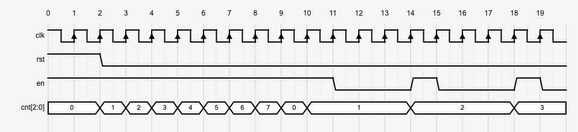
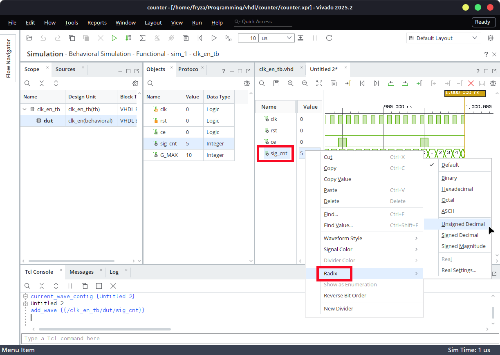
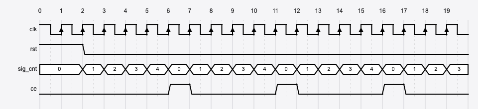
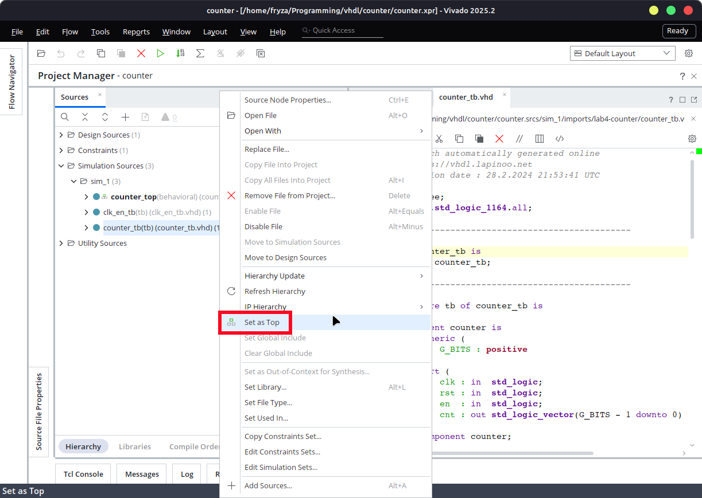
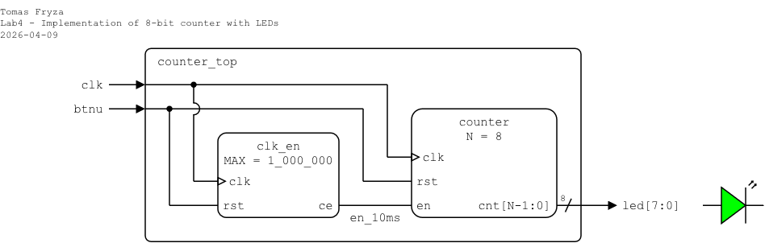
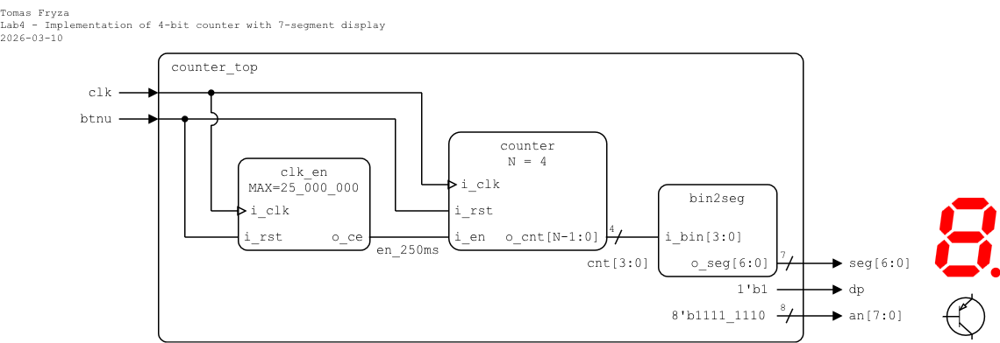
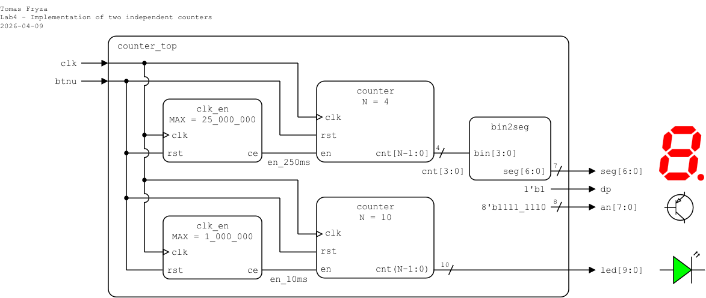

# Laboratory 4: Binary counter

* [Task 1: Binary counter](#task1)
* [Task 2: Clock enable](#task2)
* [Task 3: Top-level design and FPGA implementation](#task3)
* [Optional tasks](#tasks)
* [Questions](#questions)

### Objectives

After completing this laboratory, students will be able to:

* Use a clock enable signal to drive slower logic without creating new clock domains
* Use Verilog parameters to make designs flexible and reusable
* Implement synchronous processes with a clock and reset signals
* Understand the operation of binary counters and how N-bit outputs represent sequential counts

### Background

A binary **N-bit counter** is a digital circuit with **N output bits** representing the current count value. It counts sequentially from `0` to `2^N-1` and then wraps around back to `0`. When the reset signal is asserted, the counter is cleared and starts again from `0`.

Many digital circuits include an **enable** (clock enable) input. This signal controls whether the counter is allowed to increment. When the clock enable signal is active (typically high), the counter updates its value on each clock edge and counts normally. When the clock enable signal is inactive (typically low), the counter holds its current value and does not increment.



<a name="task1"></a>

## Task 1: Binary counter

1. Run Vivado, create a new RTL project named `counter`, add a Verilog source file `counter`, and implement a 4-bit binary counter. Use the following I/O ports:

   | **Port name** | **Direction** | **Type** | **Description** |
   | :-: | :-: | :-- | :-- |
   | `i_clk` | input | `wire` | Main clock |
   | `i_rst` | input | `wire` | High-active synchronous reset |
   | `i_en` | input | `wire` | Clock enable |
   | `o_cnt` | output | `reg [3:0]` | Counter value |

2. A **parameter** in Verilog allows the designer to configure a module at instantiation time, making the design flexible and reusable. The same module can therefore be used with different parameter values without modifying its internal implementation.

   A parameter behaves similarly to a constant:
      * Its value is defined when the module is instantiated.
      * It cannot be changed during simulation.
      * It is typically used to define sizes, limits, or timing parameters.

   In the following example, the parameter `N` defines the width of the generated binary counter. The module can be extended with such a parameter as follows:

   ```verilog
   module counter #(
       // #() after a module name introduces a parameter list
       parameter N = 4  // Number of bits for the counter
   )(
       input  wire         i_clk,  // Main clock
       input  wire         i_rst,  // High-active synchronous reset
       input  wire         i_en,   // Clock enable
       output reg  [N-1:0] o_cnt   // Counter value
   );
   ```

3. Use a Verilog **sequential always block** `always @(posedge clk) begin ... end` to describe the internal behavior of the module. This block is triggered only on the **positive (rising) edge** of the clock signal. Therefore, the described logic is **synchronous with the clock**, meaning that all signal updates occur only when the clock rises.

   ```verilog
   ...
       always @(posedge i_clk) begin
           if (i_rst) begin
               o_cnt <= 0;  // Reset counter; non-blocking assignment (<=)
           end
           else if (i_en) begin
               o_cnt <= o_cnt + 1'b1;  // Increment counter when enabled
           end
       end

   endmodule
   ```

   > **Note:** Verilog suppors **blocking** and **non-blocking** assignments. Blocking assignments (`=`) execute immediately and in order, while non-blocking assignments (`<=`) update at the end of the time step, which correctly models how flip-flops update simultaneously in hardware.

4. Create a Verilog simulation file named `counter_tb`, complete the provided template, test the functionality of the `i_rst` and `i_en` signals, and try several values of `N`.

   A module parameter allows the designer to **configure the internal properties of a module during instantiation**. When a module is instantiated, its parameters can be overridden using the `#(...)` syntax placed between the module name and the instance name.

   ```verilog
   `timescale 1ns/1ps

   module counter_tb ();

       // Local parameter value is fixed inside the module
       localparam N = 5;  // Change only this value to scale the counter

       // Testbench signals
       reg          clk;
       reg          rst;
       reg          en;
       wire [N-1:0] cnt;

       // Instantiate the counter
       counter #(
           .N (N)
       ) dut (
           .i_clk (clk),
           .i_rst (rst),
           .i_en  (en),
           .o_cnt (cnt)
       );

       // Clock generation: 10ns period (100 MHz)
       always #5 clk = ~clk;

       // The initial block executes once at the start of the simulation
       initial begin
           // Initialize
           clk = 0;
           rst = 0;
           en  = 1;

           #200  // 20 periods

           // TODO: Reset generation
    
           // TODO: Clock enable/disable sequence
 
           // Finish simulation
           $finish;
       end

   endmodule
   ```

   > **Note:** For any vector, you can change the numeric display format in the simulation viewer. To do this, right-click the vector name and select **Radix > Unsigned Decimal** from the context menu. You can also change the vector color using **Signal Color**.
   > 
   > 

5. Use **Flow > Open Elaborated design** and see the schematic after RTL analysis.

6. Use **Flow > Synthesis > Run Synthesis** and then see the schematic at the gate level.

<a name="task2"></a>

## Task 2: Clock enable

To drive other logic in the design that requires a slower operation, it is better to generate a **clock enable signal** (see figure bellow) instead of creating a new clock domain using clock dividers. Creating additional clock domains may cause timing issues or clock domain crossing (CDC) problems such as metastability, data loss, and data incoherency.



1. Calculate how many clock cycles of a 100&nbsp;MHz clock (period 10&nbsp;ns) correspond to the following time intervals. Express each result in decimal, binary, and hexadecimal forms. What is the minimum number of bits required for each counter?

   | **Time interval** | **Clock cycles (decimal)** | **Binary** | **Hexadecimal** | **Required bits** |
   | :-: | :-: | :-: | :-: | :-: |
   | 2&nbsp;ms | 200_000 | `b"11_0000_1101_0100_0000"` | `x"3_0d40"` | 18 |
   | 4&nbsp;ms |  |  |  |  |
   | 8&nbsp;ms |  |  |  |  |
   | 10&nbsp;ms |  |  |  |  |
   | 250&nbsp;ms | 25_000_000 | `b"1_0111_1101_0111_1000_0100_0000"` | `x"17d_7840"` | 25 |
   | 500&nbsp;ms |  |  |  |
   | 1&nbsp;sec | 100_000_000 | `b"101_1111_0101_1110_0001_0000_0000"` | `x"5F5_E100"` | 27 |

2. In your project, create a new Verilog design source file named `clk_en`, and implement a clock enable circuit which generates one-clock-cycle positive pulse every `MAX` clock periods.

3. Copy the [design](https://raw.githubusercontent.com/tomas-fryza/verilog-examples/refs/heads/main/examples/_solutions/lab4-counter/clk_en.v) into your `clk_en.v` file.

4. (Optionaly) Create a VHDL simulation source file named `clk_en_tb`, copy the [testbench](https://raw.githubusercontent.com/tomas-fryza/verilog-examples/refs/heads/main/examples/_solutions/lab4-counter/clk_en_tb.v), and test several `MAX` values.

   > **Note:** To select which testbench to simulate, right-click to the testbench file name and choose `Set as Top`.
   >
   > 

<a name="task3"></a>

## Task 3: Top-level design and FPGA implementation

Choose one of the following variants, implement a counter on the Nexys A7 board, and display the counter value on the LEDs (variant 1) or 7-segment display (variant 2).

### Variant 1: Counter and LEDs

1. In your project, create a new Verilog design source file named `counter_top`. Define I/O ports as follows.

   | **Port name** | **Direction** | **Type** | **Description** |
   | :-: | :-: | :-- | :-- |
   | `clk` | input | `wire` | Main clock |
   | `btnu` | input | `wire` | Synchronous reset |
   | `led` | output | `wire [7:0]` | 8-bit counter value |

2. Use module instantiation of `clk_en` and `counter`, and define the top-level structure as follows.

   

   ```verilog
       // Internal signal
       wire en_10ms;  // Clock enable for 8-bit counter

       // ---------------------------------------------------------
       // Clock enable for 10 ms
       // ---------------------------------------------------------
       clk_en #(
           .MAX (1_000_000)
       ) u_enable0 (
           .i_clk (clk),
           .i_rst (btnu),
           .o_ce  (en_10ms)
       );

       // ---------------------------------------------------------
       // 8-bit binary counter
       // ---------------------------------------------------------
       counter #(
           .N (8)
       ) u_counter0 (

           // TODO: Complete the instantiation

       );

   endmodule
   ```

3. Create a new constraints file `nexys` (XDC file). Copy relevant pin assignments from the [Nexys A7-50T](../examples/nexys.xdc) constraint file or use the following minimal constrains:

   ```xdc
   # -----------------------------------------------
   # Clock signal
   # -----------------------------------------------
   set_property -dict { PACKAGE_PIN E3 IOSTANDARD LVCMOS33 } [get_ports {clk}]; 
   create_clock -add -name sys_clk_pin -period 10.00 -waveform {0 5} [get_ports {clk}];

   # -----------------------------------------------
   # Push button
   # -----------------------------------------------
   set_property PACKAGE_PIN M18 [get_ports {btnu}]
   set_property IOSTANDARD LVCMOS33 [get_ports {btnu}]

   # -----------------------------------------------
   # LEDs
   # -----------------------------------------------
   set_property PACKAGE_PIN H17 [get_ports {led[0]}] ;
   set_property PACKAGE_PIN K15 [get_ports {led[1]}] ;
   set_property PACKAGE_PIN J13 [get_ports {led[2]}] ;
   set_property PACKAGE_PIN N14 [get_ports {led[3]}] ;
   set_property PACKAGE_PIN R18 [get_ports {led[4]}] ;
   set_property PACKAGE_PIN V17 [get_ports {led[5]}] ;
   set_property PACKAGE_PIN U17 [get_ports {led[6]}] ;
   set_property PACKAGE_PIN U16 [get_ports {led[7]}] ;
   set_property IOSTANDARD LVCMOS33 [get_ports {led[*]}]
   ```

4. Implement your design to Nexys A7 board:

   1. Click **Generate Bitstream** (the process is time consuming and may take some time).
   2. Open **Hardware Manager**.
   3. Select **Open Target > Auto Connect** (make sure Nexys A7 board is connected and switched on).
   4. Click **Program device** and select the generated file `YOUR-PROJECT-FOLDER/counter.runs/impl_1/counter_top.bit`.

5. Use **IMPLEMENTATION > Open Implemented Design > Schematic** to see the generated structure.

### Variant 2: Counter and 7-segment display

1. In your project, create a new VHDL design source file named `counter_top`. Define I/O ports as follows.

   | **Port name** | **Direction** | **Type** | **Description** |
   | :-: | :-: | :-- | :-- |
   | `clk` | in  | `wire` | Main clock |
   | `btnu` | in | `wire` | Synchronous reset |
   | `seg` | out | `wire [6:0]` | Seven-segment cathodes CA..CG (active-low) |
   | `dp` | out | `wire` | Seven-segment decimal point (active-low, not used) |
   | `an` | out | `wire [7:0]` | Seven-segment anodes AN7..AN0 (active-low) |

2. In your project, add the design source file `bin2seg.v` from the previous lab and check the "Copy sources into project".

   

3. Use instantiation of modules `clk_en`, `counter`, and `bin2seg`, and define the top-level architecture as follows.

   

   ```verilog
       // Internal signals
       wire       en_250ms;  // Clock enable for 4-bit counter
       wire [3:0] cnt;       // 4-bit counter value

       // ---------------------------------------------------------
       // Clock enable for 250 ms
       // ---------------------------------------------------------
       clk_en #(
           .MAX (25_000_000)
       ) u_enable0 (
           .i_clk (clk),
           .i_rst (btnu),
           .o_ce  (en_250ms)
       );

       // ---------------------------------------------------------
       // 4-bit binary counter
       // ---------------------------------------------------------
       counter #(
           .N (4)
       ) u_counter0 (

           // TODO: Complete counter instantiation

       );

       // ---------------------------------------------------------
       // Binary to 7-segment decoder
       // ---------------------------------------------------------
       bin2seg u_segment (
           .i_bin (cnt),
           .o_seg (seg)
       );

       // Turn off decimal point (active-low: 1 = off)
       assign dp =  // TODO

       // Enable only rightmost digit (active-low)
       assign an =  // TODO

   endmodule
   ```

4. Create a new constraints file `nexys` (XDC file). Copy relevant pin assignments from the [Nexys A7-50T](../examples/nexys.xdc) constraint file or use the following minimal constrains:

   ```xdc
   # -----------------------------------------------
   # Clock signal
   # -----------------------------------------------
   set_property -dict { PACKAGE_PIN E3 IOSTANDARD LVCMOS33 } [get_ports {clk}]; 
   create_clock -add -name sys_clk_pin -period 10.00 -waveform {0 5} [get_ports {clk}];

   # -----------------------------------------------
   # Push button
   # -----------------------------------------------
   set_property PACKAGE_PIN M18 [get_ports {btnu}]
   set_property IOSTANDARD LVCMOS33 [get_ports {btnu}]

   # -----------------------------------------------
   # Seven-segment cathodes CA..CG + DP (active-low)
   # seg[6]=A ... seg[0]=G
   # -----------------------------------------------
   set_property PACKAGE_PIN T10 [get_ports {seg[6]}] ; # CA
   set_property PACKAGE_PIN R10 [get_ports {seg[5]}] ; # CB
   set_property PACKAGE_PIN K16 [get_ports {seg[4]}] ; # CC
   set_property PACKAGE_PIN K13 [get_ports {seg[3]}] ; # CD
   set_property PACKAGE_PIN P15 [get_ports {seg[2]}] ; # CE
   set_property PACKAGE_PIN T11 [get_ports {seg[1]}] ; # CF
   set_property PACKAGE_PIN L18 [get_ports {seg[0]}] ; # CG
   set_property PACKAGE_PIN H15 [get_ports {dp}]
   set_property IOSTANDARD LVCMOS33 [get_ports {seg[*] dp}]

   # -----------------------------------------------
   # Seven-segment anodes AN7..AN0 (active-low)
   # -----------------------------------------------
   set_property PACKAGE_PIN J17 [get_ports {an[0]}]
   set_property PACKAGE_PIN J18 [get_ports {an[1]}]
   set_property PACKAGE_PIN T9  [get_ports {an[2]}]
   set_property PACKAGE_PIN J14 [get_ports {an[3]}]
   set_property PACKAGE_PIN P14 [get_ports {an[4]}]
   set_property PACKAGE_PIN T14 [get_ports {an[5]}]
   set_property PACKAGE_PIN K2  [get_ports {an[6]}]
   set_property PACKAGE_PIN U13 [get_ports {an[7]}]
   set_property IOSTANDARD LVCMOS33 [get_ports {an[*]}]
   ```

5. Implement your design to Nexys A7 board:

   1. Click **Generate Bitstream** (the process is time consuming and may take some time).
   2. Open **Hardware Manager**.
   3. Select **Open Target > Auto Connect** (make sure Nexys A7 board is connected and switched on).
   4. Click **Program device** and select the generated file `YOUR-PROJECT-FOLDER/counter.runs/impl_1/counter_top.bit`.

6. Use **IMPLEMENTATION > Open Implemented Design > Schematic** to see the generated structure.

<a name="tasks"></a>

## Optional tasks

1. Combine two independent counters:
   * 4-bit counter with a 250 ms time base
   * 10-bit counter with a 10 ms time base

   <!---->

2. Create a new component `up_down_counter` implementing bi-directional (up/down) binary counter.

<a name="questions"></a>

## Questions

1. What is the purpose of the `i_en` (clock enable) signal in the counter, and what happens when it is `0`?

2. How many bits are required in a counter to generate a pulse every 10 ms on a 100 MHz clock?

3. What is the role of the parameter `N` in the counter module?

4. Why is the sequential process written as `always @(posedge i_clk)` instead of `always @(i_clk)`?

5. What is the purpose of the `#(...)` syntax when instantiating the counter module in the testbench?

6. What is the maximum value that an N-bit binary counter can represent? Explain why.

7. If the clock frequency were changed from 100 MHz to 50 MHz, how would the `MAX` value in the `clk_en` module need to change to keep the same 10 ms enable pulse?
