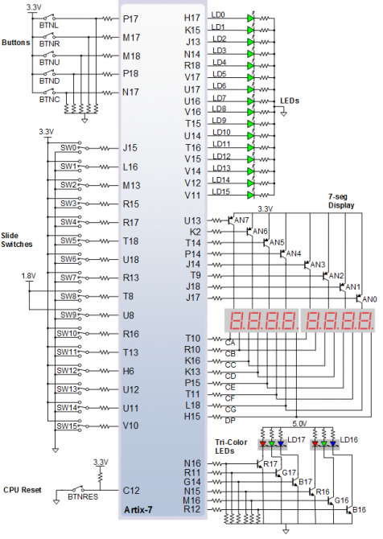
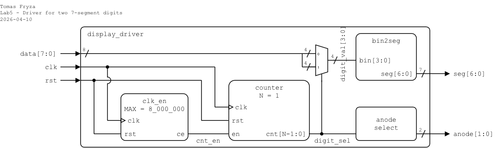
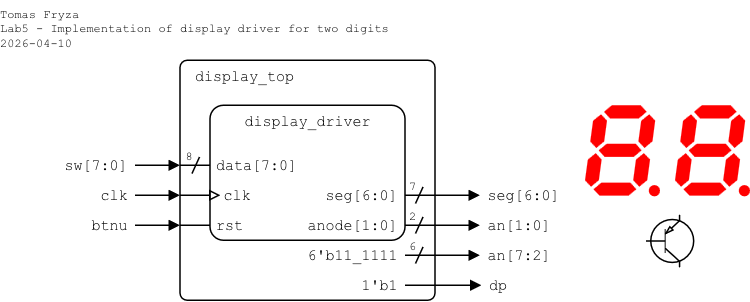
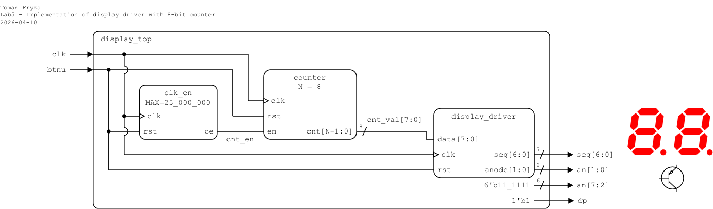
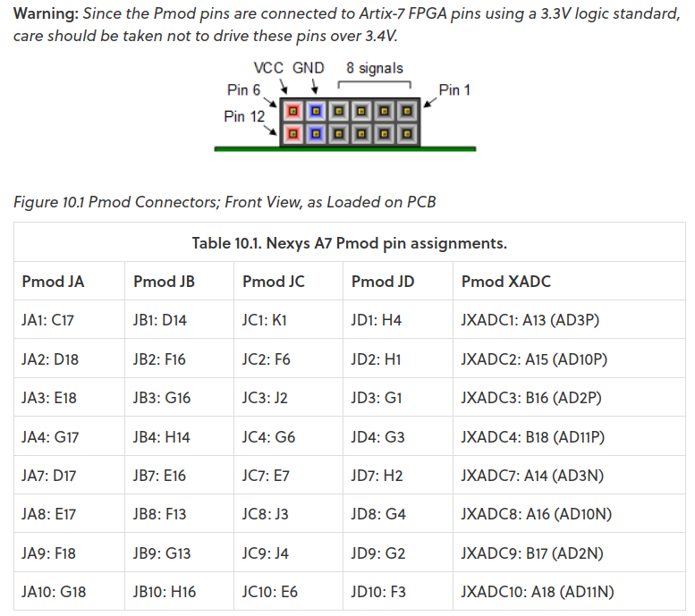
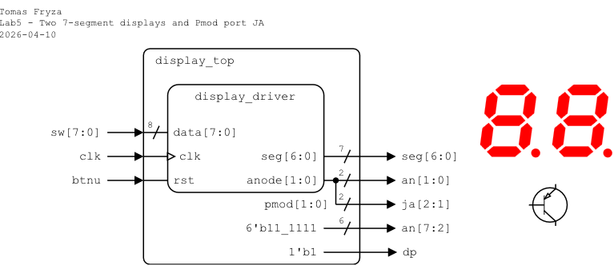

# Laboratory 5: Multiple seven-segment displays

* [Task 1: Two-digit display driver](#task1)
* [Task 2: Top-level design and FPGA implementation](#task2)
* [Optional tasks](#tasks)
* [Questions](#questions)

### Objectives

After completing this laboratory, students will be able to:

* Understand the hardware of 7-segment displays and the principles of multiplexing for multiple digits
* Use previously created Verilog modules (`clk_en`, `counter`, `bin2seg`) in new designs
* Design and implement modular Verilog components for combinational and sequential logic

### Background

The Nexys A7 board provides two four-digit common anode **seven-segment LED displays** (configured to behave like a single eight-digit display). Refer to the [schematic](https://github.com/tomas-fryza/verilog-examples/blob/master/docs/nexys-a7-sch.pdf) or [reference manual](https://reference.digilentinc.com/reference/programmable-logic/nexys-a7/reference-manual) of the Nexys A7 board to determine how the 7-segment displays are connected. Here, the common anodes are switched to 3.3 V using **PNP-type transistors**, while the individual segments and decimal points are connected directly to eight output pins.

Additionally, recall from the electronics course the differences between NPN and PNP types of bipolar junction transistors (BJTs).

   

A common way to control multiple 7-segment displays is **multiplexing**, where the displays are switched sequentially. At any given moment, only one display is enabled and connected to the supply voltage. The individual segments are shared between all displays. Due to the persistence of human vision, the switching must be fast enough so that the complete value appears continuously visible. The total refresh period should not exceed **about 16&nbsp;ms**. For example, when displaying four digits, each digit is active for approximately&nbsp;4 ms. If eight digits are used, the active time for each digit is reduced to about 2&nbsp;ms. The figure below illustrates the general principle for four 7-segment displays.

   

---

<a name="task1"></a>

## Task 1: Two-digit display driver

1. Run Vivado, create a new RTL project named `display`, and create a Verilog design source file named `display_driver` for Nexys A7-50T FPGA board. Use the following I/O ports and implement a two-digit display driver:

   | **Port name** | **Direction** | **Type** | **Description** |
   | :-: | :-: | :-- | :-- |
   | `clk`   | input  | `wire` | Main clock |
   | `rst`   | input  | `wire` | High-active synchronous reset |
   | `data`  | input  | `wire [7:0]` | Two hexadecimal digits |
   | `seg`   | output | `wire [6:0]` | {a,b,c,d,e,f,g} active-low |
   | `anode` | output | `reg [1:0]` | Anodes AN1..AN0 (active-low) |

2. In your project, add the design source files `clk_en.v`, `counter.v`, and `bin2seg.v` from the previous lab(s) and check the **Copy sources into project** option. The selected files will be copied into the corresponding Vivado project folders, ensuring that the project contains local copies of all source files.

   

3. Instantiate `clk_en`, `counter`, and `bin2seg` modules, and define the display driver structure according to the following schematic and Verilog template.

   

   ```verilog
   `timescale 1ns/1ps

   module display_driver (
       input  wire clk,         // Main clock

       // TODO: Complete input/output ports

       output reg  [1:0] anode  // Anodes AN1..AN0 (active-low)
   );

       // ---------------------------------------------------------
       // Refresh timing
       // ---------------------------------------------------------
       wire cnt_en;
       clk_en #(
           .MAX(8)      // Adjust for flicker-free multiplexing
                        // For simulation: 8
       ) enable_inst (  // For implementation: 8_000_000
           .clk(clk),
           .rst(rst),
           .ce (cnt_en)
       );

       wire digit_sel;
       counter #(
           .N(1)
       ) counter_inst (

           // TODO: Add instantiation of `counter`

       );

       // ---------------------------------------------------------
       // Digit select multiplexer
       // ---------------------------------------------------------
       wire [3:0] digit_val;
       // digit_sel = 0 -> right digit (data[3:0])
       // digit_sel = 1 -> left digit  (data[7:4])
       assign digit_val = (digit_sel == 1'b0) ? data[3:0] : data[7:4];

       // ---------------------------------------------------------
       // 7-segment decoder
       // ---------------------------------------------------------
       bin2seg decoder_inst (

           // TODO: Add instantiation of `bin2seg`

       );

       // ---------------------------------------------------------
       // Anode select (active-low)
       // ---------------------------------------------------------
       always @(*) begin
           anode = 2'b11;            // All digits off (active-low)
           anode[digit_sel] = 1'b0;  // Enable selected digit
       end

   endmodule
   ```

4. Complete all **TODO** items in the module.

5. Create a new Verilog simulation file named `display_driver_tb`, complete the provided template, and test the functionality of the display driver with several input data values.

   ```verilog
   `timescale 1ns/1ps

   module display_driver_tb ();

       // Testbench signals
       reg  clk;
       reg  rst;
       reg  [7:0] data;
       wire [6:0] seg;
       wire [1:0] anode;

       // Instantiate Device Under Test (DUT)
       display_driver dut (
           .clk  (clk),
           .rst  (rst),
           .data (data),
           .seg  (seg),
           .anode(anode)
       );

       // Clock generation: 10ns period (100 MHz)
       initial clk = 0;
       always #5 clk = ~clk;

       // Testbench stimulus
       initial begin
           // Initialize
           data = 8'h00;

           // Hold reset for a few cycles
           rst  = 1;
           #50; rst = 0;

           // Apply test value 0x18
           data = 8'h18;
           #2000;

           // Apply test value 0x19
           data = 8'h19;
           #2000;

           // Apply test value 0x20
           data = 8'h20;
           #2000;

           // Finish simulation
           $display("\nSimulation finished\n");
           $finish;
       end

       // Monitor outputs
       initial begin

           // TODO: Add display and monitor tasks

       end

   endmodule
   ```

7. Display all internal signals during the simulation.

   

8. Complete all **TODO** items in the testbench module.

9. In Vivado, use **Flow > RTL Analysis > Open Elaborated design** and see the **Schematic** after RTL analysis. Note that RTL (Register Transfer Level) represents digital circuit at the abstract level.

10. Use **Flow > Synthesis > Run Synthesis** and then see the schematic at the gate level.

---

<a name="task2"></a>

## Task 2: Top-level design and FPGA implementation

Choose one of the following variants and implement a display driver on the Nexys A7 board with switches (variant 1) or with 8-bit counter (variant 2).

### Variant 1: Switches

**Important:** Change the `MAX` parameter in the `clk_en` instantiation in the driver architecture to `8_000_000`. What is the resulting clock enable period for a 100&nbsp;MHz clock (10&nbsp;ns period)?

1. In your project, create a new Verilog design source file named `display_top`, and define I/O ports as follows.

   | **Port name** | **Direction** | **Type** | **Description** |
   | :-: | :-: | :-- | :-- |
   | `clk`  | input  | `wire` | Main clock |
   | `btnu` | input  | `wire` | High-active synchronous reset |
   | `sw`   | input  | `wire [7:0]` | Two hexadecimal digits |
   | `seg`  | output | `wire [6:0]` | Seven-segment cathodes CA..CG (active-low) |
   | `an`   | output | `wire [7:0]` | Seven-segment anodes AN7..AN0 (active-low) |
   | `dp`   | output | `wire` | Seven-segment decimal point (active-low, not used) |

2. Instantiate the `display_driver` circuit and complete the top-level module according to the following schematic and template.

   

   ```verilog
   `timescale 1ns/1ps

   module display_top (
       input  wire clk,   // Main clock

       // TODO: Complete input/output ports

       output wire dp     // Decimal point
   );

       // Display driver instance
       display_driver display_inst (

           // TODO: Add instantiation of `display_driver`

       );

       // Disable other digits and decimal points
       assign an[7:2] = 6'b11_1111;
       assign dp = 1'b1;

   endmodule
   ```

3. Complete all **TODO** items in the module.

4. Create a new constraints file named `nexys` (XDC file) and copy relevant pin assignments from the [Nexys A7-50T](../examples/nexys.xdc) template.

5. Implement your design to Nexys A7 board:

   1. Click **Generate Bitstream** (the process is time consuming and may take some time).
   2. Open **Hardware Manager**.
   3. Select **Open Target > Auto Connect** (make sure Nexys A7 board is connected and switched on).
   4. Click **Program device** and select the generated file `YOUR-PROJECT-FOLDER/display.runs/impl_1/display_top.bit`.

6. Modify the `MAX` parameter in the `display_driver.v` file so that the display does not appear to blink. What refresh period is sufficient for the human eye?

7. Use **Implementation > Open Implemented Design > Schematic** to see the generated structure.

### Variant 2: Counter

**Important:** Change the `MAX` parameter in the `clk_en` instantiation in the driver architecture to `8_000_000`. What is the resulting clock enable period for a 100&nbsp;MHz clock (10&nbsp;ns period)?

1. In your project, create a new Verilog design source file named `display_top`, and define I/O ports as follows.

   | **Port name** | **Direction** | **Type** | **Description** |
   | :-: | :-: | :-- | :-- |
   | `clk`  | input  | `wire` | Main clock |
   | `btnu` | input  | `wire` | High-active synchronous reset |
   | `seg`  | output | `wire [6:0]` | Seven-segment cathodes CA..CG (active-low) |
   | `an`   | output | `wire [7:0]` | Seven-segment anodes AN7..AN0 (active-low) |
   | `dp`   | output | `wire` | Seven-segment decimal point (active-low, not used) |

2. Instantiate the `display_driver` circuit, independent `clock_en` and 8-bit binary `counter`, and complete the top-level architecture according to the following schematic and template.

   

   ```verilog
   `timescale 1ns/1ps

   module display_top (
       input  wire clk,   // Main clock

       // TODO: Complete input/output ports

       output wire dp     // Decimal point
   );

       // 8-bit counter
       wire cnt_en;
       clk_en #(
           .MAX(25_000_000)  // Adjust counter speed
       ) clock2_inst (
           .clk(clk),
           .rst(btnu),
           .ce (cnt_en)
       );

       wire [7:0] cnt_val;
       counter #(
           .N(8)
       ) counter2_inst (

           // TODO: Add instantiation of `counter`

       );

       // 7-segment display driver
       display_driver display_inst (

           // TODO: Add instantiation of `display_driver`

       );

       // Disable other digits and decimal points
       assign an[7:2] = 6'b11_1111;
       assign dp = 1'b1;

   endmodule
   ```

3. Complete all **TODO** items in the architecture section.

4. Create a new constraints file named `nexys` (XDC file) and copy relevant pin assignments from the [Nexys A7-50T](../examples/nexys.xdc) template.

5. Implement your design to Nexys A7 board:

   1. Click **Generate Bitstream** (the process is time consuming and may take some time).
   2. Open **Hardware Manager**.
   3. Select **Open Target > Auto Connect** (make sure Nexys A7 board is connected and switched on).
   4. Click **Program device** and select the generated file `YOUR-PROJECT-FOLDER/display.runs/impl_1/display_top.bit`.

6. Modify the `MAX` parameter in the `display_driver.v` file so that the display does not appear to blink. What refresh period is sufficient for the human eye?

7. Use **Implementation > Open Implemented Design > Schematic** to see the generated structure.

---

<a name="tasks"></a>

## Optional tasks

**Pmod (Peripheral Module)** ports are standardized 6- or 12-pin connectors on FPGA and microcontroller boards, used to interface with external peripheral modules like sensors, displays, or communication devices. They provide digital I/O signals, power (VCC), and ground, making it easy to connect add-on modules without complex wiring. On the Nexys A7 board, Pmod ports can be used to drive LEDs, connect switches, or read data from external devices.

   

1. Modify the top-level design to use Pmod ports, and verify the period of the anode signals using an external logic analyzer.

   

2. Extend the `display_driver` design to control four or even eight 7-segment displays.

---

<a name="questions"></a>

## Questions

1. Explain how the common-anode 7-segment displays are connected on the Nexys A7 board. How are the anodes and segments controlled?

2. What is the purpose of using PNP transistors in the display driver circuit? Why can not the segments be driven directly without them?

3. Describe how multiplexing works for multiple 7-segment displays. Why is a fast refresh rate required?

4. How would you modify your design to extend from two digits to four or eight digits? What changes are needed in the counter width and anode selection logic?

5. What is the role of the `clk_en` component? How does changing the `MAX` parameter affect the display behavior?

6. Describe the steps required to implement the top-level design on the Nexys A7 board. What role do XDC constraints play in this process?
