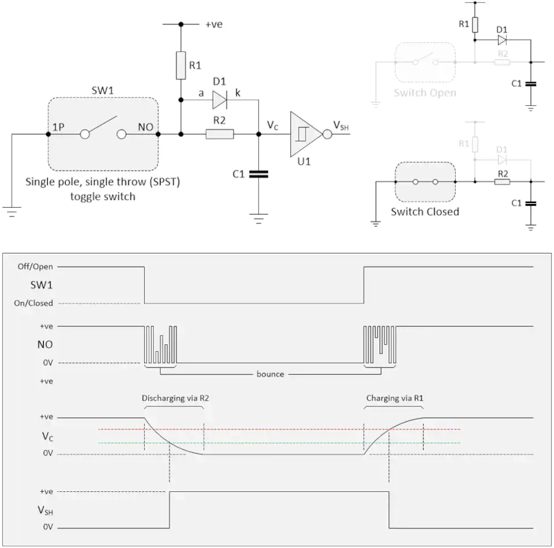
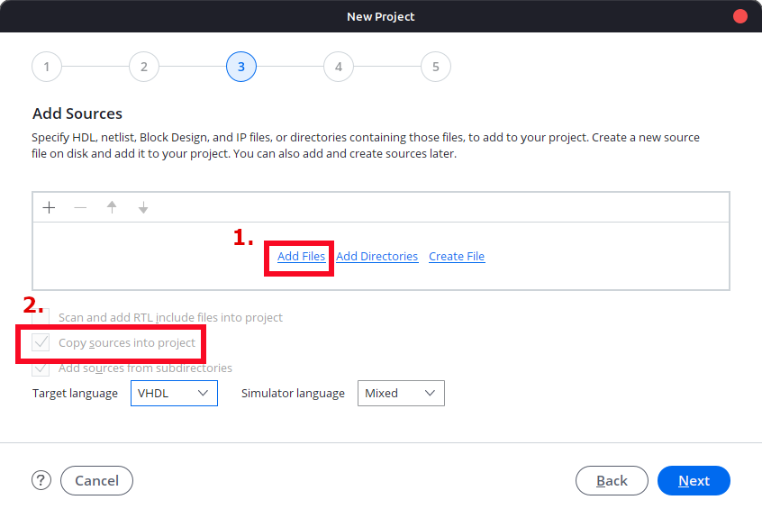
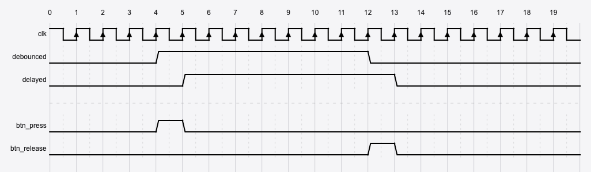
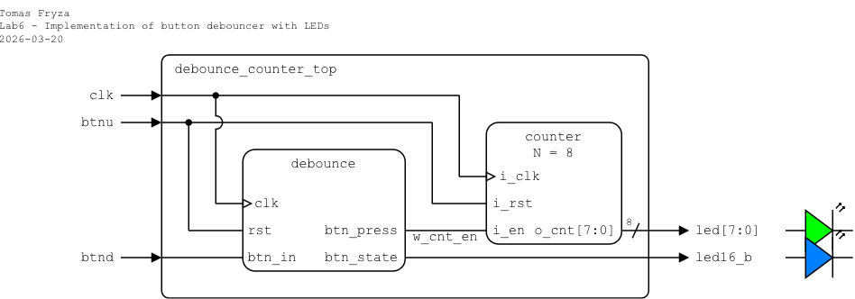
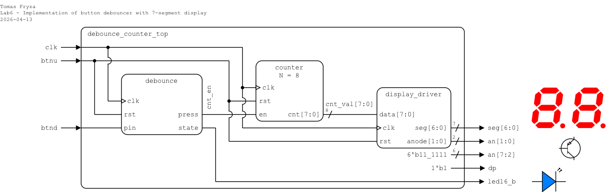

# Laboratory 6: Button debounce

* [Task 1: Debounce button](#task1)
* [Task 2: Top-level design and FPGA implementation](#task2)
* [Optional tasks](#tasks)
* [Questions](#questions)

### Objectives

After completing this laboratory, students will be able to:

* Understand mechanical switch bounce
* Implement a digital debouncer in Verilog
* Design and use a two flip-flop synchronizer for asynchronous inputs
* Use edge detectors
* Integrate multiple components into a top-level Verilog design
* Apply debouncing and edge detection in a real FPGA application

### Background

The Nexys A7 FPGA board provides five **push buttons**. Refer to the [schematic](https://github.com/tomas-fryza/verilog-examples/blob/master/docs/nexys-a7-sch.pdf) or the board [reference manual](https://reference.digilentinc.com/reference/programmable-logic/nexys-a7/reference-manual) to determine how the push-buttons are conected and what is their active level.

   

A **bouncy button**, also known as a **switch bounce**, refers to the phenomenon where the electrical contacts in a mechanical switch make multiple rapid transitions between open and closed states when pressed or released. These transitions typically occur over a period of **1–25 ms**.

As a result, a single press may be interpreted by digital logic as **multiple presses**, which can cause incorrect behavior in digital circuits. Examples of real push buttons are shown below. (Note that the active level of the buttons in these examples is low, while the buttons on the Nexys A7 board may use a different active level.)

   

   

The main methods to eliminate switch bounce are:

   1. **[Hardware debouncing](https://www.digikey.ee/en/articles/how-to-implement-hardware-debounce-for-switches-and-relays)** uses additional analog or digital circuitry to filter the bouncing signal before it reaches the digital logic. Typical components include: resistors, capacitors, Schmitt triggers.

      

   2. In FPGA designs, debouncing is typically implemented using **synchronous digital logic** described in HDL. Common techniques include: shift-register filters, counters, finite state machines, timer-based filters.

   3. **Combination approach**. In many practical systems, a combination of **hardware filtering** and **digital debouncing logic** is used to achieve robust signal conditioning.

<a name="task1"></a>

## Task 1: Debounce button

1. Run Vivado, create a new RTL project named `debounce`, and create a Verilog design source file named `debounce`. Use the following I/O ports:

      | **Port name** | **Direction** | **Type** | **Description** |
      | :-: | :-: | :-- | :-- |
      | `clk` | input  | `wire` | Main clock |
      | `rst` | input  | `wire` | High-active synchronous reset |
      | `btn_in` | input  | `wire` | Raw push-button input (may contain bounce) |
      | `btn_state` | output | `wire` | Debounced button level |
      | `btn_press` | output | `wire` | One-clock pulse generated when the button is pressed |

2. In your project, add the design source file `clk_en.v` from the previous lab(s). When adding the file in Vivado, enable the **Copy sources into project** option so that the file is copied into the current project directory.

   

3. Instantiate the `clk_en` module and implement the button debouncer architecture using the following sections:

   1. The **synchronizer** consists of two flip-flops (`sync0` and `sync1`) used to safely synchronize the asynchronous input signal to the system clock. The input signal `btn_in` is first registered by `sync0` and then by `sync1` on consecutive clock cycles. This reduces the risk of metastability when processing the push-button input.

   2. The **shift register**, defined by `shift_reg`, is a vector of flip-flops that stores the recent history of the synchronized input signal. Each time the clock-enable signal is asserted, the value of `sync1` is shifted into the register while the oldest value is discarded. By evaluating the contents of this register, the debounce logic can determine whether the button input has remained stable (either high or low) for several samples, effectively filtering out bounce.

   3. Generate the **output signals**. The debounced signal `btn_state` represents the stable state of the button after filtering out bouncing. The signal `btn_press` is a one-clock pulse generated when the button transitions from released (`0`) to pressed (`1`).

   ```verilog
       //------------------------------------------------------------
       // Constants (internal)
       //------------------------------------------------------------
       localparam C_SHIFT_LEN = 4;  // Debounce history
       localparam C_MAX       = 2;  // Sampling period
                                    // 2 for simulation
                                    // 200_000 (2 ms) for implementation !!!

       //------------------------------------------------------------
       // Internal signals
       //------------------------------------------------------------
       wire ce_sample;
       reg sync0, sync1;
       reg [C_SHIFT_LEN-1:0] shift_reg;
       reg debounced;
       reg delayed;

       //------------------------------------------------------------
       // Clock enable instance
       //------------------------------------------------------------
       clk_en #(
           .MAX (C_MAX)
       ) clock_inst (
           .i_clk (clk),
           .i_rst (rst),
           .o_ce  (ce_sample)
       );

       //------------------------------------------------------------
       // Debounce logic
       //------------------------------------------------------------
       always @(posedge clk) begin
           if (rst) begin
               sync0     <= 0;
               sync1     <= 0;
               shift_reg <= 0;
               debounced <= 0;
               delayed   <= 0;
           end else begin
               // Input synchronizer
               sync1 <= sync0;
               sync0 <= btn_in;

               // Sample only when enable pulse occurs
               if (ce_sample) begin

                   // Shift values to the left and load a new sample as LSB
                   shift_reg <= {shift_reg[C_SHIFT_LEN-2:0], sync1};

                   // Check if all bits are '1'
                   if (&shift_reg)
                       debounced <= 1;
                   // Check if all bits are '0'
                   else if (~|shift_reg)
                       debounced <= 0;
               end

               // One clock delayed output for edge detector
               delayed <= debounced;
           end
       end

       //------------------------------------------------------------
       // Outputs
       //------------------------------------------------------------
       assign btn_state = debounced;

       // One-clock pulse when button pressed
       assign btn_press = debounced & ~delayed;

   endmodule
   ```

   > **Note:** The `{}` operator is used to **join (concatenate)** two or more signals into a single, wider vector. Operands are combined from left to right, and the result is a new vector whose width is the sum of the operand widths.
   >
   > **Example:** 
   > ```verilog
   >    wire [3:0] vect   = 4'b1010;
   >    wire [4:0] result;
   >
   >    assign result = {1'b1, vect};  // result = 5'b1_1010
   > ```

4. Create a Verilog simulation file named `debounce_tb` and verify the functionality of the debouncer.

   ```verilog
   `timescale 1ns/1ps

   module debounce_tb ();

       //------------------------------------------------------------
       // Testbench signals
       //------------------------------------------------------------
       reg  clk;
       reg  rst;
       reg  btn_in;
       wire btn_state;
       wire btn_press;

       //------------------------------------------------------------
       // DUT (Device Under Test)
       //------------------------------------------------------------
       debounce dut (
           .clk       (clk),
           .rst       (rst),
           .btn_in    (btn_in),
           .btn_state (btn_state),
           .btn_press (btn_press)
       );

       //------------------------------------------------------------
       // Clock generation (10 ns period = 100 MHz)
       //------------------------------------------------------------
       always #5 clk = ~clk;

       //------------------------------------------------------------
       // Stimulus
       //------------------------------------------------------------
       initial begin
           // Init
           clk    = 0;
           rst    = 1;
           btn_in = 0;

           $display("Reset phase");
           #50;
           rst = 0;
           #20;

           $display("Simulate bouncing (fast toggling)");
           btn_in = 1; #30;
           btn_in = 0; #20;
           btn_in = 1; #40;
           btn_in = 0; #30;
           btn_in = 1;  // Finally stable HIGH
           #300;

           $display("Simulate button on release");
           btn_in = 0; #30;
           btn_in = 1; #20;
           btn_in = 0; #40;
           btn_in = 1; #30;
           btn_in = 0;  // Finally stable LOW
           #300;

           //--------------------------------------------------------
           // End simulation
           //--------------------------------------------------------
           $finish;
       end

   endmodule
   ```

5. Display the internal signals named `shift_reg`, `debounced`, and `delayed` in the waveform during the simulation.

   <!--
   
   -->

6. Use **Flow > Open Elaborated design** and see the schematic after RTL analysis.

7. Use **Flow > Synthesis > Run Synthesis** and then see the schematic at the gate level.

8. (Optional) Extend the edge detector to also detect transitions from high to low. Add an output signal `btn_release` to the entity and architecture. Which logic operation did you use to generate this signal (see figure below)?

   

<a name="task2"></a>

## Task 2: Top-level design and FPGA implementation

Choose one of the following variants and implement a button-triggered binary counter on the Nexys A7 board using LEDs (variant 1) or a 7-segment display driver (variant 2).

### Variant 1: LEDs

**Important:** Change the `C_MAX` constant in the `debounce` module to `200_000`. What is the resulting clock enable period for a 100&nbsp;MHz clock (10&nbsp;ns period)?

1. In your project, create a new Verilog design source file named `debounce_counter_top`. Define I/O ports as follows.

   | **Port name** | **Direction** | **Type** | **Description** |
   | :-: | :-: | :-- | :-- |
   | `clk` | input | `wire` | Main clock |
   | `btnu` | input | `wire` | High-active synchronous reset |
   | `btnd` | input | `wire` | Increment counter |
   | `led` | output | `[7:0] wire` | Counter value |
   | `led16_b` | output | `wire` | Button indicator |

2. In your project, add the design source file `counter.v` from the previous lab(s). When adding the file in Vivado, enable the **Copy sources into project** option so that the file is copied into the current project directory.

3. Instantiate the `debounce` and `counter` circuits, and complete the top-level module according to the following schematic and template.

   

   ```verilog
       //------------------------------------------------------------
       // Debounce instance
       //------------------------------------------------------------
       wire w_cnt_en;
       debounce debounce_inst (
           .clk       (clk),
           .rst       (btnu),
           .btn_in    (btnd),
           .btn_state (led16_b),
           .btn_press (w_cnt_en)
       );

       //------------------------------------------------------------
       // Counter instance
       //------------------------------------------------------------
       counter #(
           .N(8)
       ) counter_inst (

           // TODO: Add instantiation of `counter`

       );

   endmodule
   ```

4. Complete all **TODO** items in the module.

5. Create a new constraints file named `nexys` (XDC file) and copy relevant pin assignments from the [Nexys A7-50T](../examples/nexys.xdc) template.

6. Implement your design to Nexys A7 board:

   1. Click **Generate Bitstream** (the process is time consuming and may take some time).
   2. Open **Hardware Manager**.
   3. Select **Open Target > Auto Connect** (make sure Nexys A7 board is connected and switched on).
   4. Click **Program device** and select the generated file `YOUR-PROJECT-FOLDER/debounce.runs/impl_1/debounce_counter_top.bit`.

7. Use **Implementation > Open Implemented Design > Schematic** to see the generated structure.

### Variant 2: Display driver

**Important:** Change the `C_MAX` constant in the debouncer architecture to `200_000`. What is the resulting clock enable period for a 100&nbsp;MHz clock (10&nbsp;ns period)?

1. In your project, create a new Verilog design source file named `debounce_counter_top`. Define I/O ports as follows.

   | **Port name** | **Direction** | **Type** | **Description** |
   | :-: | :-: | :-- | :-- |
   | `clk` | input | `wire` | Main clock |
   | `btnu` | input | `wire` | High-active synchronous reset |
   | `btnd` | input | `wire` | Increment counter |
   | `seg` | output | `[6:0] wire` | Seven-segment cathodes CA..CG (active-low) |
   | `an` | output | `[7:0] wire` | Seven-segment anodes AN7..AN0 (active-low) |
   | `dp` | output | `wire` | Seven-segment decimal point (active-low, not used) |
   | `led16_b` | output | `wire` | Button indicator |

2. In your project, add the design source files `display_driver.v`, `counter.v`, and `bin2seg.v` from the previous lab(s). When adding the file in Vivado, enable the **Copy sources into project** option so that the file is copied into the current project directory.

3. Provide an instantiation of the `debounce`, `counter`, and `display_driver` circuits and complete the top-level module according to the following schematic and template.

   

   ```verilog
       //------------------------------------------------------------
       // Debounce instance
       //------------------------------------------------------------
       wire w_cnt_en;
       debounce debounce_inst (
           .clk       (clk),
           .rst       (btnu),
           .btn_in    (btnd),
           .btn_state (led16_b),
           .btn_press (w_cnt_en)
       );

       //------------------------------------------------------------
       // Counter instance
       //------------------------------------------------------------
       wire [7:0] w_cnt_val;
       counter #(
           .N(8)
       ) counter_inst (

           // TODO: Add instantiation of `counter`

       );

       //------------------------------------------------------------
       // Display driver instance
       //------------------------------------------------------------
       display_driver display_inst (

           // TODO: Add instantiation of `display_driver`

       );

       // Disable other digits and decimal points
       assign an[7:2] = 6'b11_1111;
       assign dp = 1'b1;

   endmodule
   ```

4. Complete all **TODO** items in the module.

5. Create a new constraints file named `nexys` (XDC file) and copy relevant pin assignments from the [Nexys A7-50T](../examples/nexys.xdc) template.

6. Implement your design to Nexys A7 board:

   1. Click **Generate Bitstream** (the process is time consuming and may take some time).
   2. Open **Hardware Manager**.
   3. Select **Open Target > Auto Connect** (make sure Nexys A7 board is connected and switched on).
   4. Click **Program device** and select the generated file `YOUR-PROJECT-FOLDER/debounce.runs/impl_1/debounce_counter_top.bit`.

6. Use **Implementation > Open Implemented Design > Schematic** to see the generated structure.

<a name="tasks"></a>

## Optional tasks

1. Combine both variants from Task 2 and implement a button-triggered binary counter on the Nexys A7 board using LEDs and 7-segment display driver.

2. Extend the debouncer to detect when the button is held down for a **longer period** of time. If the button remains pressed for a predefined duration (for example 500 ms), generate a new output signal `btn_long`. Use a counter driven by the system clock to measure the press duration.

<a name="questions"></a>

## Questions

1. What is switch bounce, and why is it a problem in digital circuits?

2. What is the purpose of the two flip-flop synchronizer (`sync0`, `sync1`)?

3. Explain how the shift register is used for debouncing.

4. In the expression below, what is the purpose of the `{}` operator?

   ```verilog
   shift_reg <= {shift_reg[C_SHIFT_LEN-2:0], sync1};
   ```

5. For a 100 MHz clock and `C_MAX = 200_000`, what is the clock enable period? Show your calculation.

6. What is the difference between an edge detector and a level detector?

7. Explain how a rising-edge (or falling-edge) detector works using two signals (current and delayed). What condition must be met to generate a pulse?
