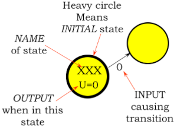
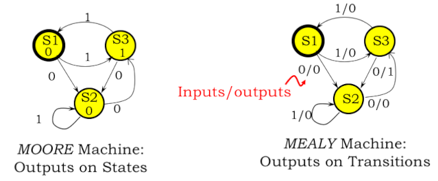
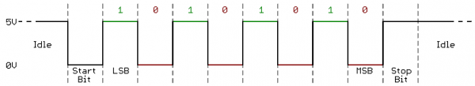
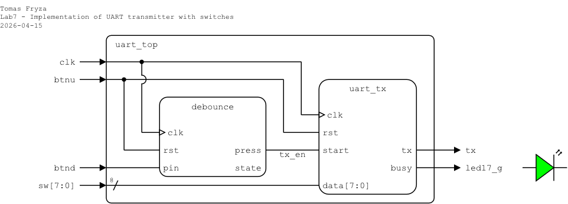
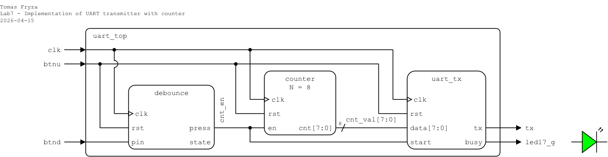
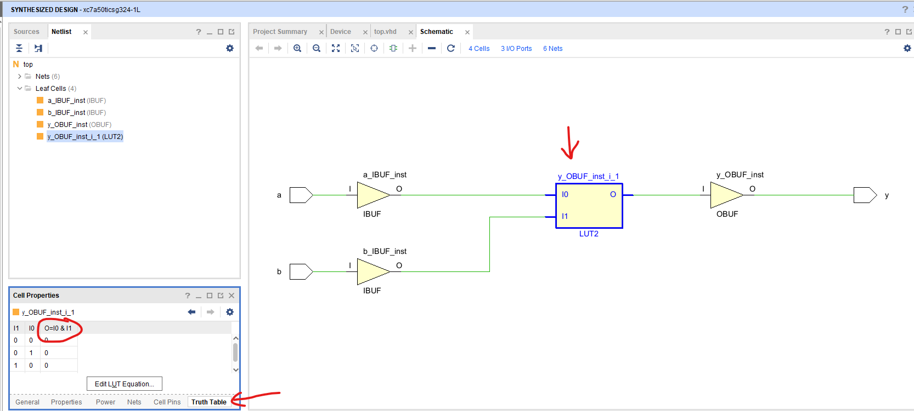
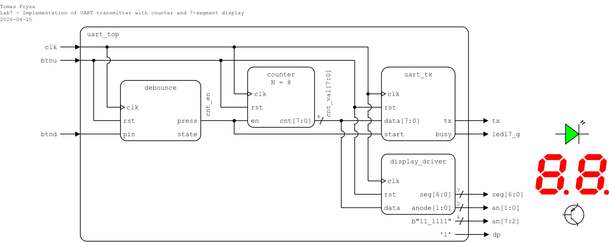
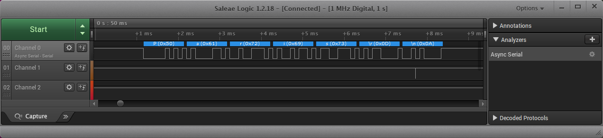

# Laboratory 7: UART transmitter

* [Task 1: UART transmitter](#task1)
* [Task 2: Top-level design and FPGA implementation](#task2)
* [Task 3: Hardware resource usage](#task3)
* [Optional tasks](#tasks)
* [Questions](#questions)

### Objectives

After completing this laboratory, students will be able to:

* Understand the philosophy and use of finite state machines
* Use state diagrams
* Understand the difference between Mealy and Moore type of FSM
* Understand the UART interface

### Background

#### Finite State Machine

A **Finite State Machine (FSM)** is a mathematical model used to describe and represent the behavior of systems that can be in a finite number of states at any given time. It consists of a set of states, transitions between these states, and actions associated with these transitions.

The main properties of using FSMs include:

   1. **Determinism**: FSMs are deterministic if, for each state and input, there is exactly one transition to a next state. This property simplifies analysis and implementation.

   2. **State Memory**: FSMs inherently have memory as they retain information about their current state. This allows them to model systems with sequential behavior.

   3. **Simplicity**: FSMs are relatively simple and intuitive to understand, making them useful for modeling and designing systems with discrete and sequential behavior.

   4. **Parallelism**: FSMs can represent parallelism by having multiple state machines working concurrently, each handling different aspects of the system.

One widely used method to illustrate a finite state machine is through a **state diagram**, comprising circles connected by directed arcs. Each circle denotes a machine state labeled with its name, and, in the case of a Moore machine, an [output value](https://ocw.mit.edu/courses/electrical-engineering-and-computer-science/6-004-computation-structures-spring-2017/c6/c6s1/) associated with the state.

   

Directed arcs signify the transitions between states in a finite state machine (FSM). For a Mealy machine, these arcs are labeled with input/output pairs, while for a Moore machine, they are labeled solely with inputs. Make sure, arcs leaving a state must be:

   * **mutually exclusive**: can not have two choices for a given input value and

   * **collectively exhaustive**: every state must specify what happens for each possible input combination; "nothing happens" means arc back to itself.

   

#### UART communication

The **UART (Universal Asynchronous Receiver-Transmitter)** is not a communication protocol like SPI and I2C, but a physical circuit in a microcontroller, or a stand-alone integrated circuit, that translates communicated data between serial and parallel forms. It is one of the simplest and easiest method for implement and understanding.

In [UART communication](https://www.analog.com/en/analog-dialogue/articles/uart-a-hardware-communication-protocol.html), two UARTs communicate directly with each other. The transmitting UART converts parallel data from a CPU into serial form, transmits it in serial to the receiving UART, which then converts the serial data back into parallel data for the receiving device. Only two wires are needed to transmit data between two UARTs. Data flows from the Tx pin of the transmitting UART to the Rx pin of the [receiving UART](https://www.circuitbasics.com/basics-uart-communication/).

UARTs transmit data asynchronously, which means there is no external clock signal to synchronize the output of bits from the transmitting UART. Instead, timing is agreed upon in advance between both units, and special **Start** (log. 0) and 1 or 2 **Stop** (log. 1) bits are added to each data package. These bits define the beginning and end of the data packet so the receiving UART knows when to start reading the bits. In addition to the start and stop bits, the packet/frame also contains data bits and optional parity.

The amount of **data** in each packet can be set from 5 to 9 bits. If it is not otherwise stated, data is transferred least-significant bit (LSB) first.

**Parity** is a form of very simple, low-level error checking and can be Even or Odd. To produce the parity bit, add all 5-9 data bits and extend them to an even or odd number. For example, assuming parity is set to even and was added to a data byte `0110_1010`, which has an even number of 1's (4), the parity bit would be set to 0. Conversely, if the parity mode was set to odd, the parity bit would be 1.

One of the most common UART formats is called **9600 8N1**, which means 8 data bits, no parity, 1 stop bit and a symbol rate of 9600&nbsp;Bd.



---

<a name="task1"></a>

## Task 1: UART transmitter

1. Run Vivado, create a new RTL project named `uart`, and create a Verilog design source file named `uart_tx` for Nexys A7-50T FPGA board. Use the following I/O ports and implement an FSM version of UART transmitter 8N1:

   | Port name | Direction | Type | Description |
   | :-: | :-: | :-- | :-- |
   | `clk`   | input  | `wire` | Main clock |
   | `rst`   | input  | `wire` | High-active synchronous reset |
   | `start` | input  | `wire` | Start transmission signal |
   | `data`  | input  | `wire [7:0]` | Data to transmit |
   | `tx`    | output | `reg`  | UART transmit line |
   | `busy`  | output | `reg`  | Transmission in progress |

2. In your module, define local parameters for FSM, internal registers to count a sequence of data bits and clock periods, and complete the code according to the following template.

   ```verilog
   `timescale 1ns/1ps

   module uart_tx (
       input  wire clk,  // Main clock

       // TODO: Complete input/output ports

       output reg  busy  // Transmission in progress
   );

       //-------------------------------------------------
       // FSM states
       //-------------------------------------------------
       localparam IDLE               = 2'd0,
                  TRANSMIT_START_BIT = 2'd1,
                  TRANSMIT_DATA      = 2'd2,
                  TRANSMIT_STOP_BIT  = 2'd3;

       reg [1:0] current_state;

       //-------------------------------------------------
       // Constants (internal)
       //-------------------------------------------------
       localparam CLK_FREQ = 100_000_000;
       localparam BAUDRATE = 9600;
       localparam MAX = 2;  // Bit period
                            // 2 for simulation
                            // CLK_FREQ / BAUDRATE for implementation

       //-------------------------------------------------
       // Internal registers
       //-------------------------------------------------
       localparam CNT_WIDTH = $clog2(MAX);
       reg [CNT_WIDTH-1:0] baud_count;
       reg [7:0] shift_reg;
       reg [2:0] current_bit_index;

       //-------------------------------------------------
       // FSM
       //-------------------------------------------------
       always @(posedge clk) begin
           if (rst) begin
               current_state     <= IDLE;
               tx                <= 1'b1;
               busy              <= 1'b0;
               shift_reg         <= 8'd0;
               current_bit_index <= 3'd0;
               baud_count        <= 0;

           end else begin

               case (current_state)

                   //-------------------------------------------------
                   // IDLE
                   //-------------------------------------------------
                   IDLE: begin
                       // TODO: Keep Tx line high

                       // TODO: Clear busy to 0

                       if (start) begin
                           shift_reg         <= data;
                           current_bit_index <= 3'd0;
                           baud_count        <= 0;
                           current_state     <= TRANSMIT_START_BIT;
                       end
                   end

                   //-------------------------------------------------
                   // START BIT
                   //-------------------------------------------------
                   TRANSMIT_START_BIT: begin
                       // TODO: Start bit is always '0'

                       // TODO: Set busy to 1

                       if (baud_count == (MAX - 1)) begin
                           baud_count    <= 0;
                           current_state <= TRANSMIT_DATA;
                       end else begin
                           baud_count <= baud_count + 1;
                       end
                   end

                   //-------------------------------------------------
                   // DATA BITS
                   //-------------------------------------------------
                   TRANSMIT_DATA: begin
                       // TODO: Transmit the least significant bit (LSB) from shift reg.

                       // TODO: Keep busy line high

                       if (baud_count == (MAX - 1)) begin
                           // shift_reg <= {1'b0, shift_reg[7:1]};
                           shift_reg <= shift_reg >> 1;

                           if (current_bit_index == 3'd7) begin
                               current_state <= TRANSMIT_STOP_BIT;
                           end else begin
                               current_bit_index <= current_bit_index + 1;
                           end

                           baud_count <= 0;
                       end else begin
                           baud_count <= baud_count + 1;
                       end
                   end

                   //-------------------------------------------------
                   // STOP BIT
                   //-------------------------------------------------
                   TRANSMIT_STOP_BIT: begin
                       // TODO: Stop bit is always '1'

                       // TODO: Keep busy line high

                       if (baud_count == (MAX - 1)) begin
                           current_state <= IDLE;
                           baud_count    <= 0;
                       end else begin
                           baud_count <= baud_count + 1;
                       end
                   end

                   //-------------------------------------------------
                   default: begin
                       current_state <= IDLE;
                   end

               endcase
           end
       end

   endmodule
   ```

3. Complete all **TODO** items in the module.

4. Create a new Verilog simulation file named `uart_tx_tb`, complete the provided template, and test the functionality of the transmitter.

   ```verilog
   `timescale 1ns/1ps

   module uart_tx_tb ();

       // Testbench signals
       reg  clk;
       reg  rst;
       reg  start;
       reg  [7:0] data;
       wire tx;
       wire busy;

       // Instantiate Device Under Test (DUT)
       uart_tx dut (
           .clk  (clk),
           .rst  (rst),
           .start(start),
           .data (data),
           .tx   (tx),
           .busy (busy)
       );

       // Clock generation: 10 ns period (100 MHz)
       initial clk = 0;
       always #5 clk = ~clk;

       // Testbench stimulus
       initial begin
           // Initialize
           rst   = 1'b1;
           data  = 8'd0;
           start = 1'b0;

           $display("\nStarting simulation...\n");
           #50;
           rst = 1'b0;

           //-------------------------------------------------
           // Send first byte: 0x44
           data  = 8'h44;
           start = 1'b1;
           #10;
           start = 1'b0;
           #10;
        
           wait (busy == 0);
           #100;
        
           //-------------------------------------------------
           // Send next byte: 0x45
           data  = 8'h45;
           start = 1'b1;
           #10;
           start = 1'b0;
           #10;
        
           wait (busy == 0);
           #100;
        
           //-------------------------------------------------
           // Send next byte: 0x31
           // data  = 8'h31;
           // start = 1'b1;
           #10;
           // start = 1'b0;
           #10;
        
           wait (busy == 0);
           #100;
        
           // Finish simulation
           $display("\nSimulation finished\n");
           $finish;
       end

   endmodule
   ```

5. Display the internal signals named `shift_reg`, `current_state` etc. in the waveform during the simulation.

---

<a name="task2"></a>

## Task 2: Top-level design and FPGA implementation

Choose one of the following variants and implement an UART transmitter on the Nexys A7 board using switches (variant 1) or a counter (variant 2).

### Variant 1: Switches

**Important:** Change the `MAX` constant in the `uart_tx` architecture to `localparam MAX = CLK_FREQ / BAUDRATE;`.

1. In your project, create a new Verilog design source file named `uart_top`, and define I/O ports as follows.

   | Port name | Direction | Type | Description |
   | :-: | :-: | :-- | :-- |
   | `clk`     | input  | `wire` | Main clock |
   | `btnu`    | input  | `wire` | High-active synchronous reset |
   | `btnd`    | input  | `wire` | Start transmission |
   | `sw`      | input  | `wire [7:0]` | Data to transmit |
   | `tx`      | output | `wire` | UART transmit line |
   | `led17_g` | output | `wire` | Transmission in progress |

2. In your project, add the design source files `debounce.v` and `clk_en.v` from the previous lab(s). When adding the file in Vivado, enable the **Copy sources into project** option so that the file is copied into the current project directory.

3. Instantiate the `debounce` and `uart_tx` circuits and complete the top-level module according to the following schematic and template.

   

   ```verilog
   `timescale 1ns/1ps

   module uart_top (
       input  wire clk,     // Main clock

       // TODO: Complete input/output ports

       output wire led17_g  // Transmission in progress
   );

       // Debounce instance
       wire tx_en;
       debounce debounce_inst (
           .clk  (clk),
           .rst  (btnu),
           .pin  (btnd),
           .state(),      // Unconnected output; will be high impedance (Z)
           .press(tx_en)
       );

       // UART TX instance
       uart_tx uart_tx_inst (

           // TODO: Add component instantiation of `uart_tx`
       );

   endmodule
   ```

4. Complete all **TODO** items in the module.

5. Create a new constraints file named `nexys` (XDC file) and copy relevant pin assignments from the [Nexys A7-50T](../examples/nexys.xdc) template.

6. Implement your design to Nexys A7 board:

   1. Click **Generate Bitstream** (the process is time consuming and may take some time).
   2. Open **Hardware Manager**.
   3. Select **Open Target > Auto Connect** (make sure Nexys A7 board is connected and switched on).
   4. Click **Program device** and select the generated file `YOUR-PROJECT-FOLDER/uart.runs/impl_1/uart_top.bit`.

7. Use [online serial monitor](https://hhdsoftware.com/online-serial-port-monitor) or Putty and receive the serial data transmitted from the FPGA board as ASCII codes, which you can look up on this [ASCII code chart](https://www.ascii-code.com/).

8. Use 8 LEDs to show the input data value.

### Variant 2: Counter

**Important:** Change the `MAX` constant in the `uart_tx` architecture to `localparam MAX = CLK_FREQ / BAUDRATE;`.

1. In your project, create a new Verilog design source file named `uart_top`, and define I/O ports as follows.

   | Port name | Direction | Type | Description |
   | :-: | :-: | :-- | :-- |
   | `clk`     | input  | `wire` | Main clock |
   | `btnu`    | input  | `wire` | High-active synchronous reset |
   | `btnd`    | input  | `wire` | Start transmission |
   | `tx`      | output | `wire` | UART transmit line |
   | `led17_g` | output | `wire` | Transmission in progress |

2. In your project, add the design source files `debounce.v`, `clk_en.v`, and `counter.v` from the previous lab(s). When adding the file in Vivado, enable the **Copy sources into project** option so that the file is copied into the current project directory.

3. Instantiate the circuits and complete the top-level module according to the following schematic and template.

   

   ```verilog
   `timescale 1ns/1ps

   module uart_top (
       input  wire clk,     // Main clock

       // TODO: Complete input/output ports

       output wire led17_g  // Transmission in progress
   );

       // Debounce instance
       wire cnt_en;
       debounce debounce_inst (
           .clk  (clk),
           .rst  (btnu),
           .pin  (btnd),
           .state(),      // Unconnected output; will be high impedance (Z)
           .press(cnt_en)
       );

       // 8-bit counter
       wire [7:0] cnt_val;
       counter #(
           .N(8)
       ) counter_inst (

           // TODO: Add component instantiation of `counter`

       );

       // UART TX instance
       uart_tx uart_tx_inst (

           // TODO: Add component instantiation of `uart_tx`
       );

   endmodule
   ```

4. Complete all **TODO** items in the module.

5. Create a new constraints file named `nexys` (XDC file) and copy relevant pin assignments from the [Nexys A7-50T](../examples/nexys.xdc) template.

6. Implement your design to Nexys A7 board:

   1. Click **Generate Bitstream** (the process is time consuming and may take some time).
   2. Open **Hardware Manager**.
   3. Select **Open Target > Auto Connect** (make sure Nexys A7 board is connected and switched on).
   4. Click **Program device** and select the generated file `YOUR-PROJECT-FOLDER/uart.runs/impl_1/uart_top.bit`.

7. Use [online serial monitor](https://hhdsoftware.com/online-serial-port-monitor) or Putty and receive the serial data transmitted from the FPGA board as ASCII codes, which you can look up on this [ASCII code chart](https://www.ascii-code.com/).

8. Use 8 LEDs to show the input data value.

---

<a name="task3"></a>

## Task 3: Hardware resource usage

1. Use **Flow > RTL Analysis > Open Elaborated design** and see the **Schematic** after RTL analysis.

2. Use **Flow > Synthesis > Run Synthesis** and then see the **Schematic** at the gate level.

   

3. Use the **Report Utilization** after the **Synthesis** and see the number of LUT (Look-Up Table), FF (Flip-Flop), and IO ports used in the implementation.

4. Use **Implementation > Open Implemented Design > Schematic** to see the generated structure.

---

<a name="tasks"></a>

## Optional tasks

1. Extend the previous task(s) by adding a `display_driver` and display the transmitted ASCII code on a 7-segment display. What ASCII code is displayed at any given time?

   

2. Extend the design to support parity bits.

3. In the `*.xdc` constraints file, remap the UART outputs to JA Pmod port on the Nexys A7 board, and display the UART values on an oscilloscope or logic analyzer.

    ### JA Pmod connector (Nexys A7)

   

   | Pin  | Signal | FPGA Pin | Description  |
   | :--: | :----- | :------- | :----------- |
   | 1    | JA1    | C17      | Data / IO    |
   | 2    | JA2    | D18      | Data / IO    |
   | 3    | JA3    | E18      | Data / IO    |
   | 4    | JA4    | G17      | Data / IO    |
   | 5    | GND    | —        | Ground       |
   | 6    | VCC    | —        | 3.3 V supply |
   | 7    | JA7    | D17      | Data / IO    |
   | 8    | JA8    | E17      | Data / IO    |
   | 9    | JA9    | F18      | Data / IO    |
   | 10   | JA10   | G18      | Data / IO    |
   | 11   | GND    | —        | Ground       |
   | 12   | VCC    | —        | 3.3 V supply |

   <span style="color:red">**Warning:** Since the Pmod pins are connected to Artix-7 FPGA pins using a 3.3V logic standard, care should be taken not to drive these pins over 3.4V.</span>

   Connect the logic analyzer to your Pmod pins, including GND. Launch the **Logic** analyzer software and start the capture. The Saleae Logic software offers a decoding feature to transform the captured signals into meaningful UART messages. Click the **+ button** in the **Analyzers** section and set up the **Async Serial** decoder.

      

      > **Note:** To perform this analysis, you will need a logic analyzer such as [Saleae](https://www.saleae.com/) or [similar](https://www.amazon.com/KeeYees-Analyzer-Device-Channel-Arduino/dp/B07K6HXDH1/ref=sr_1_6?keywords=saleae+logic+analyzer&qid=1667214875&qu=eyJxc2MiOiI0LjIyIiwicXNhIjoiMy45NSIsInFzcCI6IjMuMDMifQ%3D%3D&sprefix=saleae+%2Caps%2C169&sr=8-6) device. Additionally, you should download and install the [Saleae Logic 1](https://support.saleae.com/logic-software/legacy-software/older-software-releases#logic-1-x-download-links) or [Saleae Logic 2](https://www.saleae.com/downloads/) software on your computer.
      >
      > You can find a comprehensive tutorial on utilizing logic analyzer in this [video](https://www.youtube.com/watch?v=CE4-T53Bhu0).

---

<a name="questions"></a>

## Questions

1. List all states used in your UART transmitter FSM and describe their purpose.

2. What does it mean that FSM transitions must be mutually exclusive and collectively exhaustive?

3. What is the difference between Mealy and Moore FSM? Is your UART transmitter closer to a Mealy or Moore machine? Explain why.

4. Explain the structure of a UART frame in the 8N1 format. Why is a start bit necessary in UART communication?

5. What is ASCII, and why is it used in digital communication systems?

6. What is the ASCII code (in hex or binary) for a selected character (e.g., ‘A’, ‘0’, or ‘a’)?

7. What hardware resources (LUTs, FFs, IOs) were used by your design?
